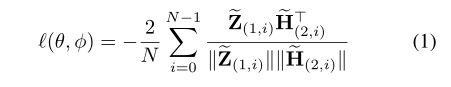

**论文名称：Bootstrapped Representation Learning on Graphs**

**论文地址：https://arxiv.org/abs/2102.06514**

**论文简介：无需负样本的自监督学习方法**

## Abstract

#### 1. Introduction

目前最先进的图神经网络自监督学习方法是基于对比学习的。因此，它们很大程度上依赖于图增强和负样本的构建。

BYOL (Grill等人，2020年)是一种自监督方法，引入于视觉领域，提供的结果与性能最佳的对比方法具有竞争力，同时避免了对负例的需要(Richemond等人，2020年)。本文将BYOL引入到图中，并提出了bootstrap Graph latent (BGRL)。BGRL通过使用两个不同的图编码器(在线编码器和目标编码器)对图的两个增强版本进行编码来学习节点表示。通过预测目标编码器的表示来训练在线编码器，而将目标编码器更新为在线网络的指数移动平均数。通过不需要对比不同的节点表示，BGRL减轻了图中的自监督学习复杂度，避免了对负例的依赖。

contribution：

1. 提出了无需负样本的BGRL，BGRL可以用于注意模型，优于使用自监督损失的更简单的卷积模型。
2. 图的对比方法需要大量的负样本才能很好地工作，并且可能会受到负样本抽样的影响

此外，文章还表明，较长的训练时间和归一化层显著提高了自监督学习性能，并在许多图数据集上提供了改进的性能。

特别的，文章首次报告了ogbn-arXiv数据集上的自监督GNN表示结果。

#### 3. Method

区别BYOL，没有projector（根据经验发现，在常见的可用图数据集的规模上，这是不需要的，而且在大多数情况下，由于提供了更间接的学习信号，实际上减慢了学习速度。）

这种学习不会坍缩到trival解。

增强方法：类似于GRACE。

#### 4. Experiments

控制BGRL目标参数φ更新速率的衰减速率τ初始化为0.99，并在训练过程中按照余弦计划逐渐增加到1.0

DGI的标准线性评估。

首先以完全无监督的方式训练每个模型，并为每个节点计算嵌入。然后，在这些冻结的嵌入之上，通过具有L2正则化的逻辑回归损失训练一个简单的线性模型(stop gradient)

使用Scikit-Learn逻辑回归实现实现该线性模型，并对附录a中描述的正则化强度进行小的超参数搜索。在较大的数据集上，如果不能在合理的时间内收敛，我们使用AdamW通过100步优化来学习线性模型。

使用余弦衰减来退火学习率

# Why work?

有效在哪部分？ema，predictor

- 不同的原样本有不同的表征，负样本的存在就是为了确保这个目标（**uniformity**）
- 同一个原样本的不同结果 / view有相同的表征（**alignment**）

一个随机初始化的CNN就已经具备一定程度的图像特征抽取能力。更进一步地，**如果CNN随机初始化之后，就已经会把不同的样本输入投射到特征空间的不同地方，并且投射得足够分散，那它就已经完成了contrastive learning框架中第一个目标**。

第二个目标就通过匹配online和target的一致性来进行拟合。本身来说MSE就是比较强的希望两个同一样本的不同augmentation结果收敛到一个表征。因此我们的主要目标还是在于说对希望模型能够多学习uniformity的性质，因此我们使用ema希望teacher不要太快跟上student的步伐（它更新慢或许能保持这种分散开的特性，使得online network的不同图片在regress的时候target是不同的，进而帮助阻止模型塌陷）论文Table 5说明，跟得太快会破坏contrastive特性，跟得太慢又有损训练效率

一种trade off

0.8408 vs 0.6668

参考：

https://www.zhihu.com/question/402452508