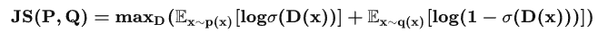

**论文名称：Deep Graph Infomax**

**论文地址：https://arxiv.org/abs/1809.10341**

**论文简介：最大化高阶全局表示和输入的局部部分的互信息**

## Abstract

DGI依赖于最大化patch表示和相应的图的高阶表示之间的互信息（encoding都是GNN模型）。学习到的patch表1示以感兴趣的节点为中心总结子图，因此可以在下游的节点学习任务中重用。与大多数使用GCNs进行无监督学习的方法相比，DGI不依赖于随机游走目标，并且很容易适用于转导和归纳学习设置。

前置知识：

如何理解互信息：通过了知道一个变量减少了对另一个变量的不确定性

核心公式

两个随机分布之间的差异：

X,Z完全无关，即独立时，此时KL散度最小，互信息最小，得不到有用的信息

$\mathrm{I}(X ; Z)=D_{\mathrm{KL}}\left(p_{(X, Z)} \| p_X p_Z\right)$

其中

$D_{\mathrm{KL}}(P \| Q)=\sum_{x \in \mathcal{X}} P(x) \log \left(\frac{P(x)}{Q(x)}\right)$

所以：

$\mathrm{I}(X ; Z)=D_{\mathrm{KL}}\left(p_{(X, Z)} \| p_X p_Z\right)$

​               $=\sum_{z \in \mathcal{Z}} \sum_{x \in \mathcal{X}} p_{(X, Z)}(x, z) \log \left(\frac{p_{(X, Z)}(x, z)}{p_X(x) p_Y(z)}\right)$

同理：对于连续型：

$D_{\mathrm{KL}}(P \| Q)=\int_{-\infty}^{\infty} p(x) \log \left(\frac{p(x)}{q(x)}\right) d x$

$\mathrm{I}(X ; Z)=\int_{\mathcal{Z}} \int_{\mathcal{X}} P_{(X, Z)}(x, z) \log \left(\frac{P_{(X, Z)}(x, z)}{P_X(x) P_Z(z)}\right) d x d z$

对于联合分布 $P(x, z) = p(z\mid x) {p}(x)$

#### 1. Introduction

介绍了为什么要做无监督；常见的无监督方法：随机游走，重构邻接信息（核心idea 邻接节点的嵌入也接近）；缺点：强调邻接忽略结构，超参数设计；

所以提出了一个新模型：基于互信息的无监督图学习。思路来源：DIM；DIM训练编码器模型，使其最大限度地利用高级“全局”表示和输入的“patch”部分(如图像的补丁)之间的互信息。这鼓励编码器携带出现在所有位置(因此是全局相关的的信息类型。

[DIM](https://arxiv.org/pdf/1808.06670.pdf)：如何学习到一个不错的编码表示？保留原始数据重要信息-》训练一个解码器可以还原出来；用来还原自编码器的最小化重构误差（MSE）是否合理？好特征一定要能够重构出来吗（区分人和动物没必要逐像素比较），甚至好特征不一定能够完成重构；

好特征：应当是“能够从整个数据集中辨别出该样本出来”，提取出该样本（最）独特的信息

提出了最大化互信息；

$\mathrm{I}(X ; Z)=\int_{\mathcal{Z}} \int_{\mathcal{X}} P_{(X, Z)}(x, z) \log \left(\frac{P_{(X, Z)}(x, z)}{P_X(x) P_Z(z)}\right) d x d z$

对于联合分布 $P(x, z) = p(z\mid x) {p}(x)$

则

$\begin{equation}I(X,Z) = \iint p(z|x)\tilde{p}(x)\log \frac{p(z|x)}{p(z)}dxdz\label{eq:mi}\end{equation}$

引入了变分自编码器中的对于隐变量 z，

假定服从先验q(z)(一般是个高斯分布)，因此loss就是互信息和约束的某个加权和：

最大化互信息的三种方式：第一种是MINE里面提到的KL散度的Donsker-Varadhan形式得到一个下界值用来估计互信息值：

此外，目的是要最大化互信息，而不是估计其值（方法一可以作为互信息的估计值），但我们可以采用其他非KL散度的形式，引入了Jensen-Shannon MI估计：

部分的推理过程：

引入f-GAN：https://arxiv.org/abs/1606.00709，对各种散度进行估算：分别从两个分布进行采样，然后计算T(x)与g(T(x))的平均值，优化T，使得它们的差最大，最终的结果即为散度的估算值。T(x)可以用足够复杂的神经网络去拟合。

还有一种infonce估计：

最终的loss为三部分叠加：

#### 2. Related Work

#### 3. Method

两种互信息，Global和Local

表示与先验进行匹配

1. 如何得到局部特征(patch representations);
2. 如何得到全局特征(global summaries);
3. 如何得到负样本的局部特征；
4. 如何设计判别网络D，区分正负patch-summary pairs；

对于局部特征，用的是patch，加一层GCN，自动学习到的就是patch的特征表示了；

全局特征就是简单的readout函数；

DIM中负样本是用另一张图像作为fake，在图上用的是节点扰动(node shuffling)，扰动后的patch再和原图去做对比

判别器就是一个普通的双线性二元分类器

#### 4. Experiments

#### 5. Discussion and Conclusion

参考资料：