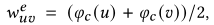

**论文名称：Graph Contrastive Learning with Adaptive Augmentation**

**论文地址：https://arxiv.org/abs/2010.14945**

**论文简介：用于图对比学习的自适应增强方法**

## Abstract

近年来，对比学习成为一种成功的无监督图表示学习方法。大多数图CL方法首先对输入图进行随机增强，以获得两个图视图，并使两个图视图中的表示的一致性最大化。尽管图的CL方法发展迅速，但是图的增广方案的设计——CL的一个重要组成部分——却很少被研究。我们认为数据增强方案应该保留图的固有结构和属性，这将迫使模型学习对不重要节点和边的扰动不敏感的表示。然而，现有的方法大多采用统一的数据增强方案，如uniformly dropping edges and uniformly shuffling features，导致性能不佳。提出了一种新的具有自适应增强的图对比表示学习方法，该方法结合了图的拓扑和语义方面的各种先验。具体而言，**在拓扑层上，设计了基于节点中心性度量的增强方案，以突出重要的连接结构**。**在节点属性级别，我们通过向不重要的节点特征添加更多噪声来破坏节点特征，以强制模型识别底层语义信息**。我们在各种真实数据集上进行了大量的节点分类实验。实验结果表明，我们提出的方法始终优于现有的最先进的基线，甚至超过一些监督的同行，验证了所提出的自适应增强对比框架的有效性。

总的来说：GRACE+Adaptive Augmentation

#### 1. Introduction

存在的问题：

1. 如DGI中的特征drop，不足以生成不同的邻域，特别是当节点特征稀疏时，导致比较目标的优化困难。

2. 其次，之前的工作忽略了在执行数据增强时节点和边的影响差异。例如，如果通过统一删除边来构造图视图，**删除一些有影响的边会降低嵌入质量**。因此，在drop edge时，可以给予不重要的边较大的概率，给予重要的边较低的概率。motivation：能够引导模型忽略不重要边上引入的噪声，从而学习输入图的重要模式。

为此，文章提出了一种新的无监督图表示学习对比框架，自适应增强的图对比学习(graph contrast learning with Adaptive augmentation, GCA)。

在GCA中，首先通过对输入执行随机augmentation生成两个相关的图视图。然后，使用对比损失训练模型，以最大限度地提高节点嵌入在这两个视图中的一致性。

具体而言，在**拓扑**和**节点属性**层面提出了一种联合的、自适应的数据增强方案，即drop edge和mask feature，为不同视图中的节点提供不同的上下文，从而促进对比目标的优化。

how to do？

1. 中心性度量来识别重要的边和特征维度。在拓扑层面上，给予不重要的边较大的删除概率来自适应地删除边，以突出重要的连接结构。

   在节点属性级别，通过向不重要的特征维度添加更多噪声来破坏属性，以强制模型识别底层语义信息。

#### 3. Method

自适应图数据增强的两个维度

- 拓扑结构的数据增强

对于图的拓扑结构，考虑采用随机移除边的方式来进行数据增强，具体的，就是从原始边集合 $\mathcal{E}$ 采样一个子集 $\tilde{\mathcal{E}}$，采样过程依照以下概率：

节点中心性（node centrality）是度量节点影响力时广泛使用的度量。我们通过边的两个节点的中心性来定义边$(u,v)$的中心性$w_{uv}^{e}$。给定一个节点中心性度量$\varphi _{c}(\cdot ):\mathcal{V}\rightarrow \mathbb{R}^{+}$，边的中心性定义为两个节点中心性的平均：

（如果是有向图的话只考虑边指向的节点的节点中心性来作为边的中心性）

有了边的中心性后根据这个确定边的保留概率：

（采取一些设置来缓解连接密集的节点的影响(有些度可能跨越数量级)），接着概率通过一个标准化的过程来获得

这里的$p_{e}$是一个超参数来控制移除边的总体概率，$s_{max}^{e}$和$u_{s}^{e}$是$s_{uv}^{e}$的最大值和平均值，并且$p_{\tau }<1$，是一个截断概率，用来防止过高的移除概率导致对图的过分破坏。

对于节点中心性的度量，采用以下三种：度中心性、特征向量中心性以及PageRank中心性

**度中心性：**在有向图中采用节点的入度。原理：假设重要的节点就是拥有许多连接的节点。

**特征向量中心性：**对应于邻接矩阵的最大特征值的特征向量。特征向量中心性的基本思想是，一个节点的中心性是相邻节点中心性的函数。也就是说，与你连接的人越重要，你也就越重要。不同于度中心性，度中心性假设所有邻居对节点的重要性贡献相等，特征向量中心性也考虑了邻居节点的重要性。

**pagerank中心性：**来自受欢迎的网页的跳转应该重于不太受欢迎的网页的跳转

计算了Karate Club的边中心性分数，该数据集包含两组学生，分别由两名教练带领。不同方案计算的边中心性值如图所示。

**尽管三种方案表现出细微的差异，但所有的增强方案都倾向于强调连接两个组内两个教练(橙色)的边缘，而不太关注组间外围节点之间的链接。验证了所提出的基于节点中心的自适应拓扑增强方案能够识别图的基本结构。**

- 节点属性的数据增强

类似拓扑结构的数据增强，节点属性维度的mask概率$p_{i}^{f}$应该反映第$i$个维度的重要性，假设在重要的节点中频繁出现的维度是重要的，以此来定义特征维度的权重。$\varphi_c$是节点中心性度量，用于量化节点的重要性。对于稀疏one-hot节点特征，比如$x_{ui}\in \left \{0,1\right \}$，维度$i$的权重计算为：

对于稠密特征，

与拓扑增强类似，对权重进行归一化，获得代表特征重要性的概率。

给定一个含有 n 个结点的有向图，在有向图上定义随机游走（ random walk）模型，即一阶马尔可夫链，其中结点表示状态，有向边表示状态之间的转移

给定一个包含 n 个结点的强连通且非周期性的有向图，在其基础上定义随机游走模型。假设转移矩阵为 M ， 在时刻 0,1,2,⋯,t,⋯ 访问各个结点的概率分布为

平稳分布 R 称为这个有向图的 PageRank。 R 的各个分量称为各个结点的 PageRank 值。

显然pagerank满足如下性质：

在基本定义的基础上导入平滑项，考虑另一个完全随机游走的模型，其转移矩阵的元素全部为 1/n ， 也就是说从任意一个结点到任意一个结点的转移概率都是 1/n 

