**论文名称：GCC: Graph Contrastive Coding for Graph Neural Network
Pre-Training**

**论文地址：https://arxiv.org/abs/2006.09963.pdf**

**论文简介：图对比编码-一种自监督的图神经网络训练前框架，用于捕获跨多个网络的通用网络拓扑特性。**

## Abstract

我们设计了图对比编码GCC-一个自我监督的图神经网络预训练框架，以捕获跨多个网络的通用网络拓扑属性。我们将GCC的代理任务设计为网络中的**子图实例判别**，并利用对比学习使图神经网络能够学习内在的和可转移的结构表征。

#### 1. Introduction

过去网络研究中发现的一些通用的结构属性：度分布的幂律性；

Leskovec发现的很多实图都满足致密和收缩定律。还有一些跨图存在的性质：

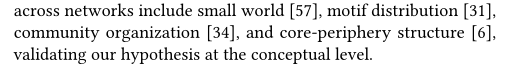

过去几年的研究从结构学习转变到graph respresentation，端到端的学习；存在问题，都是task-specific的表示学习。结合

(1)图表示学习的局限性

(2)常见结构模式发现的现有技术，

作者自然给出了提问：我们可以普遍地从网络中学习可转移的代表性图嵌入吗?

CV, NLP；Bert等一类pre-trained model as a good initialization for fine-tuning的范式。

作者想做的事情：给定一组(不同的)输入图，如Facebook社交图和DBLP合著者图，用一个自监督任务在这些输入图上预训练GNN，然后针对不同的图学习任务对它进行微调。如US-Airport图上的节点分类。

问题又自然的出现了：怎么设计代理任务，使网络内和跨网络的通用结构模式能够被捕获和进一步传递？

作者引入了对比学习：代理任务是实例判别（从输入图中采样实例，将每个实例视为一个独立的类，然对实例进行判别和区分）

又有了3个问题：实例是什么？区分实例的规则是什么？如何对实例进行编码？（即对比学习的范式）

实例：对于每个顶点，我们从其多跳ego网络中抽取子图作为实例

区分规则：GCC旨在区分从某个顶点采样的子图和从其他顶点采样的子图

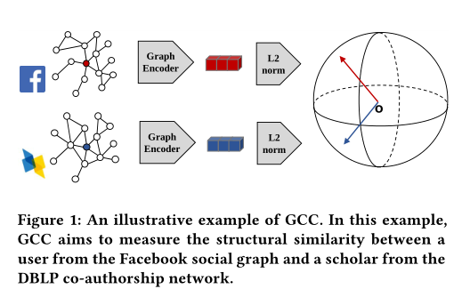

编码器：最后，对于每个子图，我们使用一个图神经网络(文中用的是GIN)作为图编码器

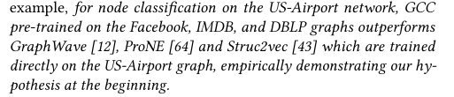

#### 2. Related Work

1.节点相似性的度量：

Neighborhood similarity：紧密连接的顶点应该被认为是相似的。

Structural similarity：具有相似局部结构的顶点应该被认为是相似的；本文提出的也是学习结构相似性。不同于领域内的其他工作，作者用对比学习和图神经网络从数据中学习结构相似性。

Attribute similarity：GCN [25], GAT [53], GraphSAGE [16, 62] and MPNN [13]

2.对比学习：

用的是实例判别任务和InfoNCE loss

3.图预训练

Skip-gram based model存在的问题：都是邻域，不能处理未见过的情况

Pre-training graph neural networks：Hu等人[19]在标记图上预训练GNN，对于分子图，代理任务是恢复mask分子图中的原子类型和化学键类型。

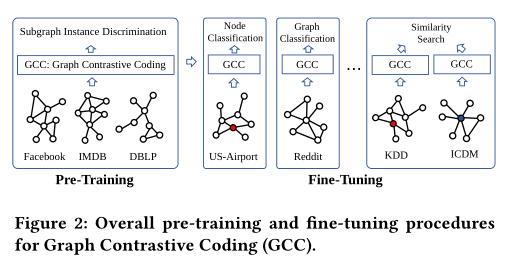

#### 3. Method

假设：在不同的图中存在共同的和可转移的结构模式；

学习的encoder：

1.结构相似性，它将具有相似局部网络拓扑的顶点在向量空间中相互靠近;

2.可转移性，它兼容预训练期间不可见的顶点和图形。

问题设置：无特征无标签

训练：

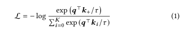

问题：

1.如何在图中定义子图实例?

2.如何在图中定义类似((不类似))的实例对，例如，对于查询xq，哪个键xk是匹配的?

3.什么是合适的图形编码器fq和fk ?

回答：

1.不同于CV和NLP直接图像和句子作为实例，文章提出的重点是纯粹的结构化表示，没有额外的输入特性/属性。（选择单个顶点作为实例是不可行的，因为它不适用于区分两个顶点）所以使用子图作为对比实例，将每个单个顶点扩展到其局部结构，即r-ego network：Sv = {u: d(u,v)≤r}，以某一点为中心，采用带有重启的随机游走，取其他点和这个点最短距离为r的点的集合，称为Sv；顶点v的r-ego网络，用Gv表示，是由Sv诱导的子图。

2.正负样本定义：将同一个r-ego网络的两个随机数据增广作为一个相似的实例对，并将数据增广定义为图采样[27]。图抽样是一种从原始图中获得代表性子图样本的技术。假设我们想要扩充顶点v的自我网络(Gv)， GCC的图采样遵循三个步骤:**重启随机漫步**(RWR)、**子图归纳**和**匿名化**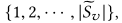

重复上述过程两次，创建两个数据扩展，即形成了一个正样本对。

图编码器：作者说GCC模型对编码器不敏感，所以用了GIN；而文章研究的是结构表示，所以对于节点输入特征初始化为每个采样子图的图结构。定义广义位置嵌入：假设一个子图有邻接矩阵A和度矩阵D，我们对其归一化图拉普拉斯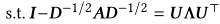，取U作为特征，还加入了one-hot encoding of vertex degrees [59] and the binary indicator of the ego vertex [42] as vertex features.

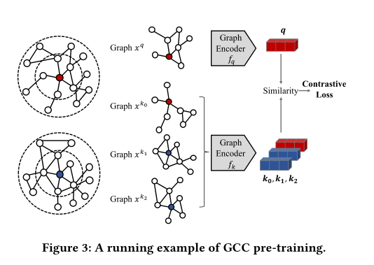

具体学习，同时使用end2end和moco两种。

下游任务：对于图级任务，可以通过GCC对输入图本身进行编码来实现表示。对于节点级任务，可以通过编码其r-ego(或由r-ego扩展而来的子图)来定义节点表示。

两种模式：linear prob or fine-tuning

基于子图，扩展性强，可以分布式训练。

#### 4. Experiments

三个任务：节点分类、图分类和相似度搜索；6个图数据集；

对于特征的评估，用SVM或逻辑回归

第一类比较：linear prob，都用特征接一层分类器

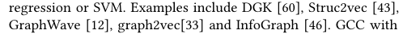

第二类比较：完整的端到端：

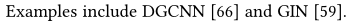

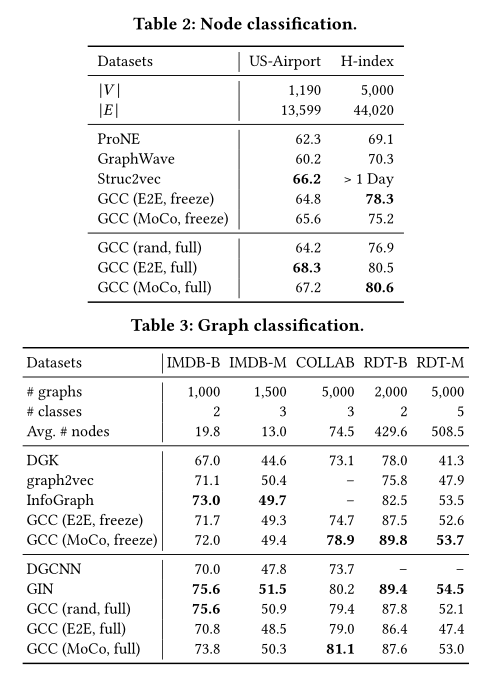

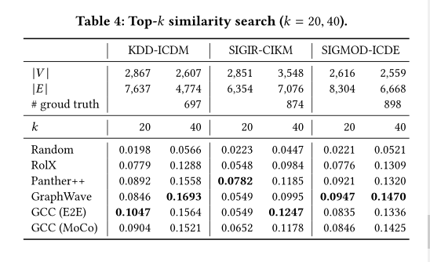

综上，GCC在几个流行的图数据集上预先训练的图神经网络编码器可以直接适应新的图数据集和不可见的图学习任务。更重要的是，与从零开始训练的模型相比，重用的模型实现了具有竞争力的性能，有时甚至更好。这证明了图结构模式的可转移性，以及我们的GCC框架在捕获这些模式方面的有效性。

消融实验：

1.预训练是否有效：

目前还不清楚GCC的良好性能是由于预先训练还是由于其GIN[59]编码器的表达能力。为了回答这个问题，我们用随机初始化的GIN编码器完全微调GCC，这相当于从头开始训练一个GIN编码器。我们将这个模型命名为GCC (rand)，如表2和表3所示。在除IMDB-B之外的所有数据集中，GCC (MoCo)的性能都优于随机初始化的同类，这表明预训练总是比随机初始化为微调提供了一个更好的起点。对于IMDB-B，我们将其归因于训练前数据和下游任务之间的域转移。

2.对比损失：

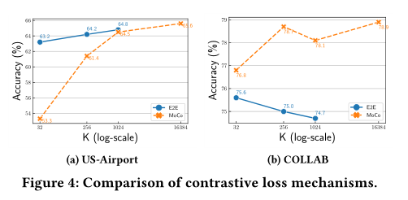

3.动量

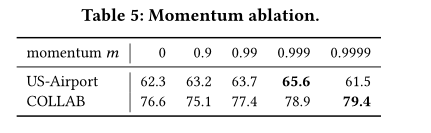

4.预训练数据集

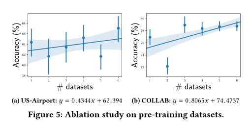

#### 5. Discussion and Conclusion

在这项工作中，我们研究了图神经网络的预训练，目的是表征和转移社会和信息网络中的结构表征。我们提出了图对比编码(GCC)，这是一个基于图的对比学习框架，用于从多个图数据集预训练图神经网络。在10个图数据集上的3个图学习任务中，预先训练的图神经网络达到了与从零开始监督训练的同类竞争的性能。
