**论文名称：Rethinking and Scaling Up Graph Contrastive Learning: An Extremely Efficient Approach with Group Discrimination**

**论文地址：https://arxiv.org/abs/2206.01535**

**论文简介：对现有的图对比方法进行重新审视**

## Abstract

1. 重新审视现有的图对比方法 (DGI和MVGRL), 引入了一种新颖有效的图对比学习范式, Group Discrimination (GD)。
2. 基于GD, 提出了一种新的图自监督模型, GGD，训练速度和收敛速度都很快, 以及高可扩展性，在大图上也能比较好的工作。
3. 进行了大量的实验（包含最大的图数据集obgn-paper100M），实验结果表明，该论文提出的方法达到了sota，而效率和占用的内存比基线要少得多。

#### 1. Introduction

现有方法DGI, MVGRL, GMI, GRACE核心思想：

最大化锚节点与其正样本节点之间的互信息，共享相似的语义信息，对于锚节点与负样本则相反

存在的问题：训练资源大

其他改进办法：BGRL和GBT

BGRL不用负样本，GBT基于Barlow-Twins，借用了冗余减少原理的思想，并利用基于互相关的损失来建立嵌入维度之间的对比。但还是要练比较久

#### **motivation：提高自监督的训练效率**

观察：DGI中的技术缺陷（即 Sigmoid 函数的不当应用）

提出了：Group Discrimination，不进行相似性计算，而是直接将一组正节点与一组负节点区分开

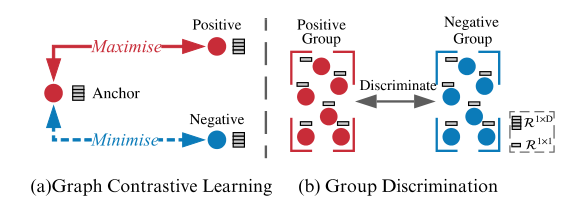

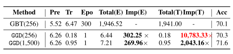

#### 3. Method

重新回顾DGI，

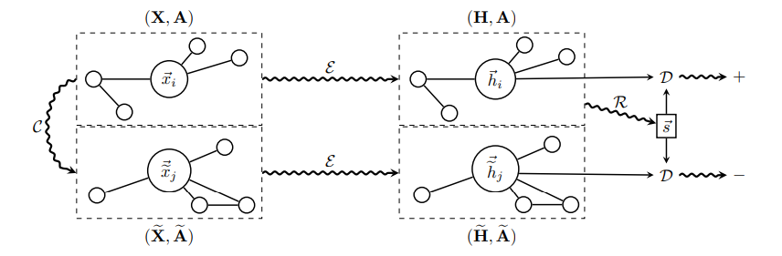

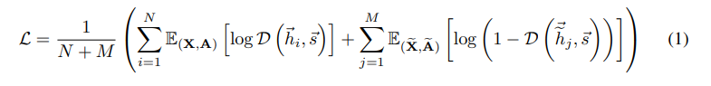

DGI对比的是patch node和summary，但是得到的summary vector其实是一个近似constant vector，即使训练了GNN编码器，summary vector中的常数保持不变

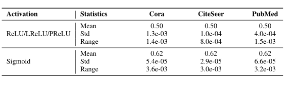

当对常量进行改变时，

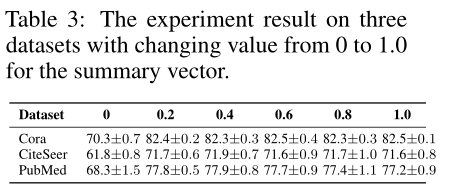

只有为0的时候坍塌了，而其他情况summary对模型影响不大，说明DGI关于锚节点和summary之间通过最大化互信息学习的假设不成立，那为什么DGI能够工作呢？

首先对loss进行简化：

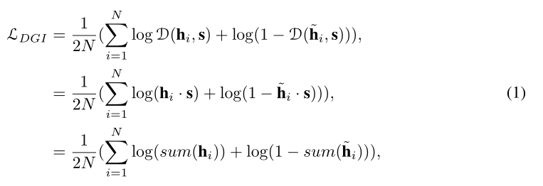

1. 将 summary vector 设置为 单位向量（缩放对损失不影响）

2. 去掉 Discriminator （Bilinear ：先做线性变换，再求内积相似度）的权重向量；【双线性层的 $W$ 其实就是一个线性变换层】

3. 补上 Discriminator 隐含的aggregation操作

   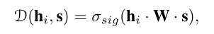

   最终版：其中 $\hat{y}_i=\operatorname{agg}\left(\mathbf{h}_i\right)$

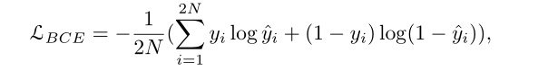

DGI 真正所做的是：

区分正确拓扑生成的一组节点和损坏拓扑生成的节点，即使用一个固定的向量 s 去区分两组节点嵌入矩阵（postive and negative）。

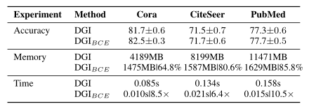

略微增强性能，但是内存，时间大幅优化

因此，可以提出一个新的范式：Group Discrimination ：不再是最大化互信息，而是区分不同组的节点样本来学习。

将不同组别的节点划分给不同的组，对于 postive pair 和 negative pair 分别划分到 "1" 组 和 "0" 组。

**所以为什么编码器可以学到东西？学习避免犯“错误”（即，使编码器偏向于避免错误的样本）**

整体框架：

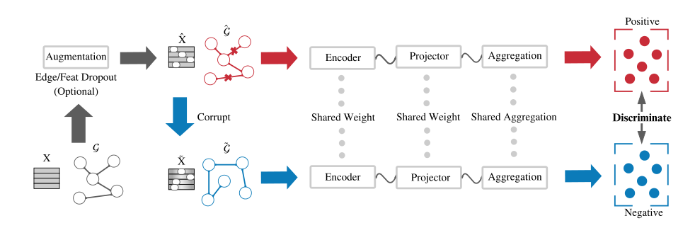

对比模式，图增强，loss，负采样，得到的嵌入用于下游任务	