**论文名称：HOW POWERFUL ARE GRAPH NEURAL NETWORKS**

**论文地址：https://arxiv.org/abs/1810.00826**

**论文简介：与WL测试鉴别能力相当的图同构网络GIN**

## Abstract

目前的GNN框架大多遵循递归邻域聚合（或者消息传递）框架，并且已经出现各种GNN变种。然而，新的GNN设计大多基于经验直觉、启发式和实验试错。目前，对神经网络的性质和局限性的理论认识较少，对神经网络表征能力的形式化分析也比较有限。

本文提出一种理论框架，用于分析GNN的表征能力。本文受到Weisfeiler-Lehman (WL)图同构测试的启发，WL测试类似于GNN，也通过聚合邻域节点特征来递归更新节点特征向量，以此来区分不同的图。WL测试是一种性能优越的算法，这主要得益于其单射的（injective）聚合更新过程，能够将不同的节点邻域映射到不同的特征向量。本文的一个核心观点是如果GNN的聚合模式具备充分的表达能力且能够建模单射函数，那么其就能够拥有像WL测试一样的鉴别能力。

形式化地来说，一个节点的邻域可以被看做是一个multiset，也就是一个可以包含重复元素的set，因此GNN中的聚合可以看做是multiset上的聚合函数。为了能够具备充分的表达能力，一个GNN就必须能够聚合不同的multiset到不同的表示。

本文的主要结果如下：
 ①本文显示GNN在识别图结构方面，WL测试是能达到的性能的上限；
 ②阐述了GNN达到WL测试的性能时在邻域聚合和readout函数方面应该满足的条件；
 ③识别出一些GNN变种（比如GCN、GraphSAGE等）不能识别的图结构；
 ④开发了一种全新的GNN变种，即图同构网络（Graph Isomorphism Network, GIN），其鉴别能力与WL测试相当。

#### 1. Introduction

Weisfeiler-Lehman测试：

图同构问题讨论的是两个图在拓扑上是否相同。这个问题具备相当的挑战性，目前尚无多项式复杂度的算法。

除了一些极端情况之外，WL图同构测试是一种有效的、计算效率高的算法，用于区分广泛的图。WL测试的一维形式“naïve vertex refinement”算法类似于GNN中的聚合，具体做法是迭代地进行：
 ①聚合节点的标签和其邻域；
 ②利用哈希函数来将聚合的标签映射成新的标签。

一般地，图中的每个节点都具有特征（attribute）和结构（structure）两种信息，需要从这两方面入手，来计算ID。很自然地，特征信息（attribute）即节点自带的Embedding，而结构信息可以通过节点的邻居来刻画，举个例子，如果两个节点Embedding相同，并且他们连接了Embedding完全相同的邻居，我们是无法区分这两个节点的，因此这两个节点ID相同。由此，可以想到，我们可以通过 hashing 来高效判断是否两个节点ID一致。1维的Weisfeiler-Lehman正是这样做的。如果设 $h_i$ 表示节点 $v_i$ 的特征信息（attribute），那么 Weisfeiler-Leman 算法的更新函数可表示为：

$h_l^{(t)}(v)=\operatorname{HASH}\left(h_{l}^{(t-1)}(v), \mathcal{F}\left\{h_l^{(t-1)}(u) | u \in N(v)\right\}\right)$

这里的标签可以理解为一维条件下的节点特征。当在某一次迭代过程后如果两个图的节点标签有所不同，则认为这两个图是非同构的。

类比GCN, GraphSAGE, 相似的更新形式背后：为什么他们的能力达不到1-WL test？

因为单层感知机不是单射函数。拼接邻居方式的近似引入了另一层精度损失，因为比如求和，pooling等邻居聚合方式可能作用于不同的邻居集合下而得到相同的结果，所以不管是哪个模型，都没有达到目前Weisfeiler-Leman算法在图同构问题上的能力。

$$
a_v^{(k)}=\operatorname{AGGREGATE}^{(k)}\left(\left\{h_u^{(k-1)}: u \in \mathcal{N}(v)\right\}\right), \quad h_v^{(k)}=\operatorname{COMBINE}^{(k)}\left(h_v^{(k-1)}, a_v^{(k)}\right)
$$
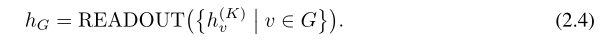

对于GNN中的每个节点来说，他们都是通过递归的融合邻居信息来捕获图的结构信息和邻居特征信息，因此每个节点的更新路径是一个树结构，节点位于树根，从叶子节点逐层向上更新Embedding直到根节点。比如在下图中，对于一个两层的图神经网络，节点$B$的更新路径是一个高为2的数，$B$位于树根。更新方向如下箭头方向所示：

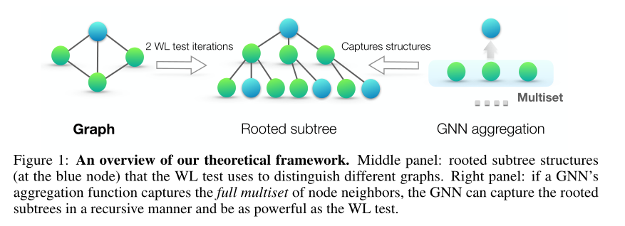

为了分析GNN的表示能力，我们转而研究**什么样的GNN结构能够保证将两个不同的节点投影到不同的Embedding空间中**(即为它们生成不同的Embedding)。直觉上可知，最强大的GNN结构仅会将拥有完全相同子树结构的两个节点投影到相同的Embedding空间(即这两个节点的Embedding相同，他们的邻居的Embedding相同，数量也相同)。因为子树结构可以通过节点递归得定义得到(如上图中$B$的二度子树结构可以定义为$B$的一度子树结构以及一度子树$(A,C,E)$的1度子树结构)，因此我们的分析可以简化为”最强大的GNN结构仅会将拥有完全相同1度邻域的两个节点投影到相同的Embedding空间”。这里1度领域不仅包括节点的1度邻居，也包括节点自身。即为以节点为根，高为1的子树结构。

因此，下一步我们可以将节点的一度邻居表示出来，由于图上节点邻居没有相对的次序性，因此MultiSet这个数据结构最适合表示这样的领域。Multiset和set不同，Multiset允许集合中的元素出现多次。**Multiset是一个2元组 $X=(S, m)$, 其中$S$是集合中的元素，$M$表示该元素出现的次数**。

因此，GNN的表示能力可以这样分析：最强大的GNN能够将两个节点投影到不同的Embedding空间(为这两个节点生成不同的Embedding向量)，除非这两个节点Embedding和1度邻居完全相同。节点的1度邻居可以用Multiset表示，因此最强大的GNN一定能够将两个不同的Multiset映射到不同的Embedding空间。所以最终问题就转化成了设计这样的GNN函数，使得$GNN(v_1, Multiset_1) = GNN(v_2, Multiset_2)$成立当且仅当 $h_1 = h_2$, $Multiset_1 = Multiset_2$multiset中包含节点的1度邻居信息，包括邻居的数量和Embedding

所以要想设计一个强大的GNN模型，我们要做到是设计AGGREGATEA、COMBINE以及 READOUT函数使得经过这三个函数映射后不同的multiset能够保持不同，即这些函数都是单射函数(injective function)。为此，作者证明了几个定理：

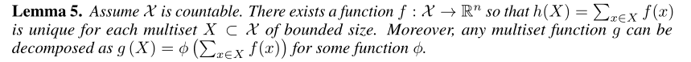

​	存在对于mutilset的单射函数f，使用concat方法为sum时，可以区分X

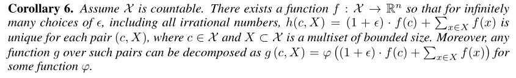

​	存在对于h(c, X)的单射函数，直接将自身与邻接节点进行拼接，可以区分c和X

​	因此：最终设计的网络满足单射性质：

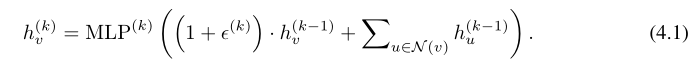

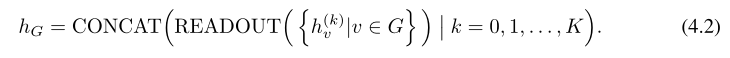

对比GCN和GraphSAGE，回答前面的问题：为什么他们的能力达不到1-WL test

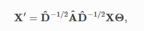

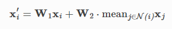

不同聚合方法能力排名：

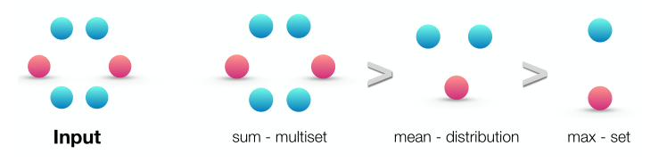

Mean或者max-pooling难以识别的结构：

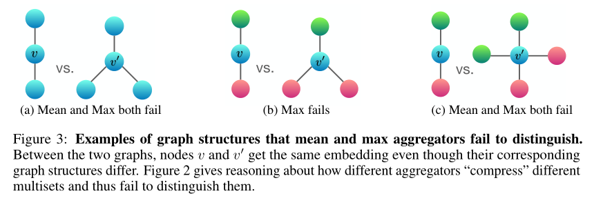

mean学习的是分布：

考虑$X_1=(S, m)$ and $X_2=(S, k \cdot m)$，mean聚合函数会将这两个multiset聚合得到相同的表示，因此mean聚合函数学习到的是multiset中元素的分布（或者说比例）。

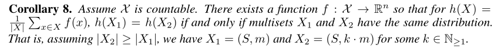

对于任务来说，如果图中的统计信息和分布信息比精确结构更重要，则mean聚合函数可以有很好的性能。此外，当节点特征多样且很少重复时，mean聚合函数与sum聚合函数性能相当。具有mean聚合函数的GNN对于文章主题分类和社区检测等节点分类任务是有效的，这些任务节点特征丰富，邻域特征的分布为任务提供了强信号。

Max聚合函数学习具有显著元素的set：

上面的图显示max聚合函数将具有相同特性的多个节点视为只有一个节点，也就是将multiset看做set。Max聚合函数既不识别精确结构也不识别分布，然而，它可能适合于识别具有代表性的元素或“骨架”。之前的研究表明，max聚合函数能够识别一个3D点云的骨架，并且对噪声和离群值有一定的健壮性。

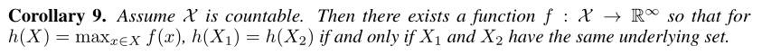

#### 4. Experiments

#### 5. Discussion and Conclusion

参考：

https://www.jianshu.com/p/3b072a2813cf

https://archwalker.github.io/blog/2019/06/22/GNN-Theory-WL.html

https://archwalker.github.io/blog/2019/06/22/GNN-Theory-Power.html