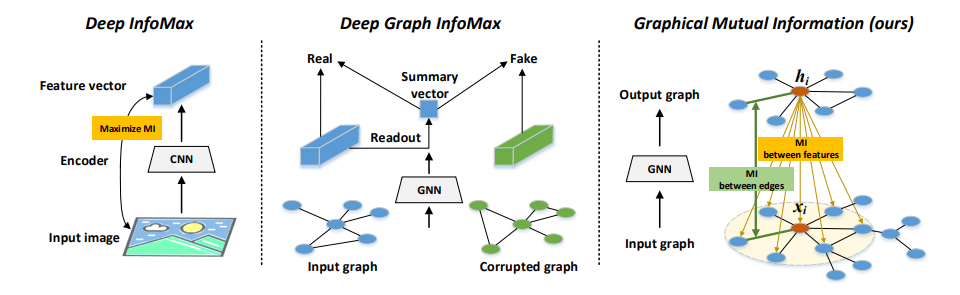

**论文名称：Graph Representation Learning via Graphical Mutual Information Maximization**

**论文地址：https://arxiv.org/abs/2002.01169**

**论文简介：节点和patch级别的图对比学习**

## Abstract

#### 1. Introduction

Deep Graph Infomax (DGI) ，通过最大化图级别表示向量和隐藏表示互信息之间的互信息（全局和局

部信息之间的互信息），来区分 Positive graph 和 Negative graph 。其存在的问题是：获取图级别表

示的 Readout 函数常常是单射的，但是 Readout 的单射性质会受到参数训练方式的影响，这表明 

Readout 函数在某些情况下会变成非单射。当 Readout 函数非单射时，图表示中包含的输入图信息将

随着输入图的大小增大而减小（一对多造成）。

本文提出了一种直接的方法来考虑图结构方面的 MI，而**不使用任何 Readout 函数和 **

**corruption function**，作者通过比较编码器的输入（即由输入邻域组成的子图）和输出（即每个节

点的隐藏表示），直接推导出 MI。

#### 3. Method

作者理论推导表明，直接导出的 MI 可以分解为每个邻居特征和隐藏向量之间的局部 MI 的加权和。这

样，对输入特征进行了分解，使 MI 计算易于处理。此外，如果调整权值，这种形式的 MI 可以很容易

地满足对称性质。由于上述 MI 主要是在节点特征级别上测量的，作者称之为**特征互信息（FMI）**。

$I\left(\boldsymbol{h}_{i} ; \boldsymbol{X}_{i}\right)=\sum\limits _{j}^{i_{n}} w_{i j} I\left(\boldsymbol{h}_{i} ; \boldsymbol{x}_{j}\right)$

　　关于上述提到的 FMI，存在着两个问题：

- 组合的权重仍然未知；　　

- 没有考虑到拓扑结构；　　

　　为解决这两个问题，作者定义了基于 FMI 提出了 Graphical Mutual Information（GMI），GMI 

将 FMI 中的权重设置为表示空间中每个邻居和目标节点之间的距离。为了保留拓扑信息，GMI 通过从

图的另一个方面（即拓扑视图）构造可训练的权值，这样$w_{ij}$的值就可以更灵活，并捕获图的内在属

性。最终，推导出了图形互信息(GMI)的定义：
$\begin{array}{c} I\left(\boldsymbol{h}_{i} ; \mathcal{G}_{i}\right):=\sum\limits _{j}^{i_{n}} w_{i j} I\left(\boldsymbol{h}_{i} ; \boldsymbol{x}_{j}\right)+I\left(w_{i j} ; \boldsymbol{a}_{i j}\right), \\ \text { with } w_{i j}=\sigma\left(\boldsymbol{h}_{i}^{\mathrm{T}} \boldsymbol{h}_{j}\right) \end{array}$

​       wij衡量了一个局部MI对全局MI的贡献，通过hi和hj之间的相似性实现了$ I\left(\boldsymbol{h}_{i} ; \mathcal{x}_{j}\right)$的贡献。同时

$I\left(w_{i j} ; \boldsymbol{a}_{i j}\right)$最大化wij和输入图的边权重之间的互信息，强制使得wij符合拓扑关系。

​      从这个意义上讲，贡献的程度将与拓扑结构中的接近度一致。如果节点j“更接近”节点i，wij可能更

大，否则可能更小。该策略弥补了FMI只关注节点特征的缺陷，并使局部MI自适应地对全局MI有贡

献。当处理未加权图时，可以用负交叉熵损失替换第二个MI项，最小化交叉熵也有助于MI最大化，并

提供了一个更有效的计算。

在**细粒度节点级别**的**隐藏向量**和**节点和边的输入特征**方面具有显式的相关性

## 参考链接

https://www.cnblogs.com/BlairGrowing/p/16060026.html