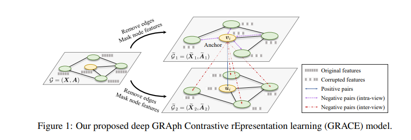
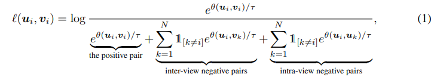
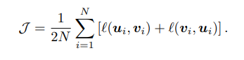

**论文名称：Deep Graph Contrastive Representation Learning**

**论文地址：https://arxiv.org/abs/2006.04131**

**论文简介：基于节点级的图上对比学习**

## Abstract

利用节点级别的对比目标最大化两个视图(属性和结构)中节点表示的一致性来学习节点表示，提高输入节点特征和高级节点嵌入之间的MI，主要侧重于对比节点级别的嵌入。

数据增强方法：从一个图分别用删边和Mask的方法生成,两个视图,对于一个视图内:目标节点与其他节点生成视图内的负样本对,在视图间,目标节点和另一个视图中除了anchor的其他节点成为负例,anchor成为正例。

Encoder：两层GCN

对比层次：节点级别（Local-Local）

