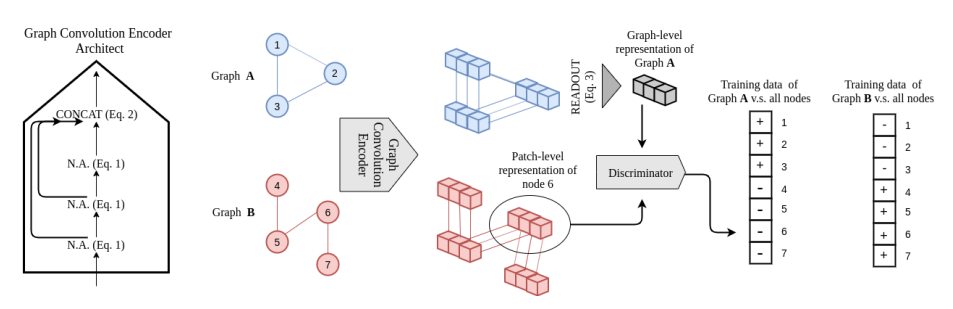
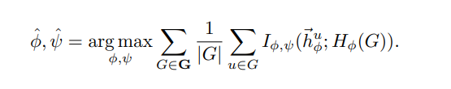
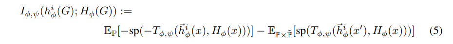
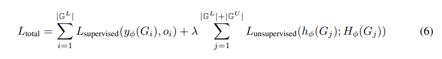
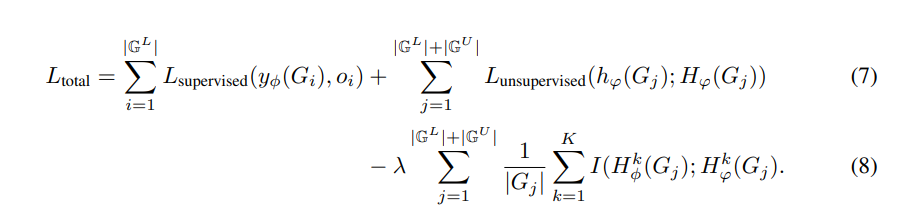
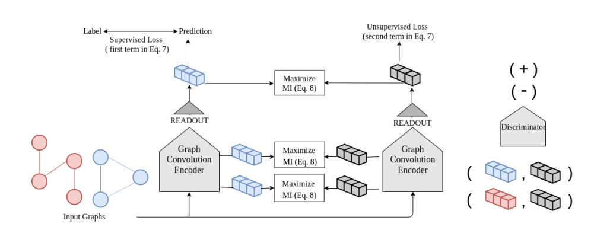

**论文名称：InfoGraph: Unsupervised and Semi-supervised Graph-Level Representation Learning via Mutual Information Maximization**

**论文地址：https://arxiv.org/abs/1908.01000**

**论文简介：基于节点和图级表征的互信息最大化得到良好的图节点表征**

## Abstract

本文提出的InfoGraph是一种基于互信息最大化的图对比学习方法，与Deep Graph Infomax（DIM）相比，虽然都是基于互信息最大化的方法，InfoGraph更加侧重于图的表示学习，而DIM偏重于节点的表示学习。

过去的图相关的任务大多是监督学习任务，而图数据的标注通常是困难的和繁琐的，而对于大量的无标注数据未能有效利用。本文提出的InfoGraph侧重于图的无监督表示学习，另外InfoGraph\*​是在InfoGraph基础上拓展的半监督学习方法。InfoGraph*应用一个类似于Mean-Teacher方法的student-teacher框架，通过让一个encoder学习另一个encoder（最大化两者的互信息）从而在半监督任务上产生了较好的效果。

#### Method

图分类任务：

思路：通过最大化图表示和patch表示之间的互信息来获得图的表示。通过这样的方式，图表示能够学习编码数据结构中共享的信息

半监督InfoGraph

将无监督的方法拓展成半监督的方式是将无监督的损失作为有监督目标的正则项

在学习预测相应的监督标签时，模型将受益于从大量无标签数据中学习良好的表示。

然而，监督任务和非监督任务可能偏好不同的信息或不同的语义空间。简单地使用同一个encoder来结合这两个损失可能会造成“负迁移”（negative transfer）。本文对此改进的方法就是采用两个encoder，也就是一个监督encoder和一个无监督encoder。为了将学习到的表示从无监督encoder转移到监督encoder，我们定义了一个损失项，它鼓励两个encoder学习到的表示在所有层上都具有高的互信息：

参考资料：

https://www.jianshu.com/p/3669067b2cf6