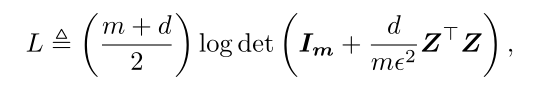

**论文名称：Self-Supervised Learning via Maximum Entropy Coding**

**论文地址：**

**论文简介：**

## Abstract

#### 1. Introduction

本工作的主要目的是提高自监督学习表征在不可见的下游任务和数据分布下的泛化能力，并尽可能减少专门设计的代理任务带来的偏差。（代理任务会对下游任务有偏见，导致泛化性差）

这自然提出了一个问题，即，什么构成了可泛化的表示?为了回答这个问题，我们特别受到信息论中的最大熵原理的启发，该原理指出，在给定可测试信息(如准确性)的情况下，最能代表关于系统的当前知识状态的概率分布是熵最大的概率分布，这样就不会引入额外的偏差或假设[38,39,59]。因此，我们假设一个可推广的表示法是在所有模糊的表示法中具有最大熵的表示法。

直观地说，如果我们能够以闭式解表示熵，那么最大熵原则就可以作为优化目标，并监督表示学习。

熵很难算->转化为最小编码长度

熵在概念上等价于对数据进行无损编码所需的最小比特数，因此最小无损编码长度可以用来表示熵。然而，连续随机变量的无损编码在我们的情况下是不可行的，因为它通常需要无限个比特，破坏了数值的稳定性。相反，我们利用有损数据编码[16]中的编码长度作为连续随机变量熵的计算可处理的代理。给定一组样本Z，编码失真Z所需的最小比特数遵循coding length function：

我们注意到，式(1)中高维矩阵的log-行列式的计算是非常昂贵的，并且可能导致病态矩阵的数值不稳定结果，这阻碍了其应用于大规模的预训练(例如，超过100万张图像)。因此，需要对式(1)进行可伸缩且稳定的重构。

利用$det(exp(A)) = exp(Tr(A))$得到

$L=\operatorname{Tr}\left(\mu \log \left(\boldsymbol{I}_{\boldsymbol{m}}+\lambda \boldsymbol{Z}^{\top} \boldsymbol{Z}\right)\right)$

之后再用泰勒展开得到

$\ln (x+1)=\Sigma_{k=1}^{\infty}(-1)^{k+1} \frac{x^k}{k}$

当x<=1时级数收敛

#### 2. Related Work

#### 3. Method

#### 4. Experiments

#### 5. Discussion and Conclusion

