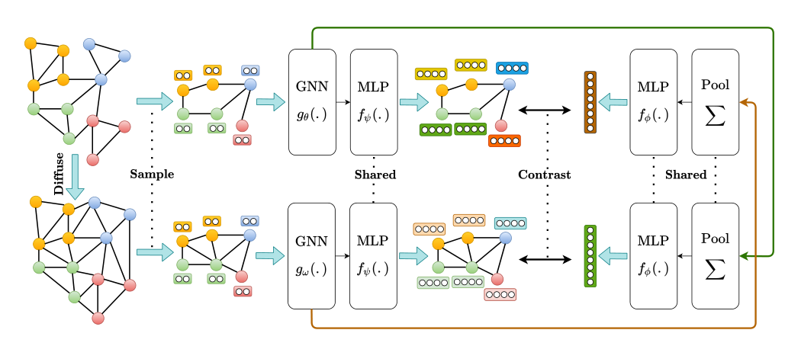
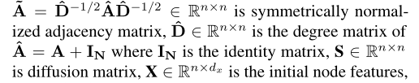
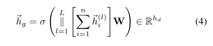
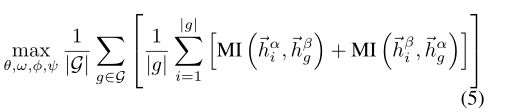
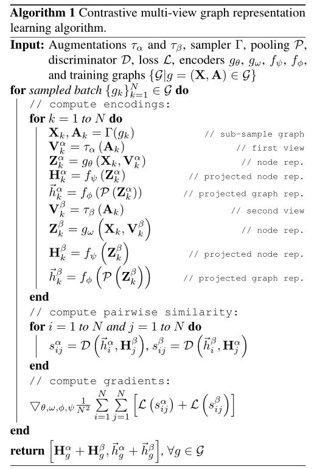
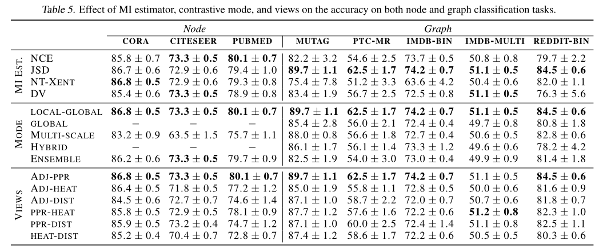

**论文名称：MVGRL: Contrastive Multi-View Representation Learning on Graphs**

**论文地址：https://arxiv.org/abs/2006.05582**

**论文简介：**对比图的结构视图，本文引入了一种学习节点和图级别表示的自监督方法。与视图表示学习不相同的是，对于图结构的对比学习来讲，增加对比视图的数量或者增加对比编码的尺寸并不能提高性能。本文发现，最佳性能是通过对比一阶邻居的编码和图扩散来实现的。

## Abstract

我们引入了一种通过**对比图的结构视图**来学习节点和图级表示的自监督方法。我们表明，与视觉表示学习不同，将视图数量增加到两个以上或对比多尺度编码不会提高性能，最佳性能是通过一阶邻域和图扩散的对比编码实现的。在线性评估协议下，我们在8个节点和图分类基准中的8个上实现了自我监督学习的最新结果。例如，在Cora(节点)和Reddit-Binary(图)分类基准上，我们实现了86.8%和84.5%的准确性，相对于之前的先进水平分别提高了5.5%和2.4%。与监督基准相比，我们的方法在8个基准中有4个优于监督基准。

#### 1. Introduction

多视角视觉表征学习的最新进展(Tian CMC(Contrastive Multiview Coding))，其中使用数据增强的组合生成同一图像的多个视图，用于对比学习，在图像分类基准超越监督基线方面取得了最先进的结果。

然而，目前还不清楚如何将这些技术应用于以图数据。为了解决这个问题，我们引入了一种自我监督的方法，通过最大化从图的不同结构视图编码的表示之间的MI来训练图编码器。我们的研究表明，我们的方法在不需要专门的架构的情况下，在节点和图分类任务上都比以前的自监督模型有显著的优势。我们还表明，与监督基线相比，它在某些基准上的表现与强基线相同或更好。

(1)增加视图的数量，两个视图不会提高性能，最好的性能是通过一阶近邻的对比编码和一般的图扩散实现的，(2)跨视图的节点和图编码对比在这两个任务上比对比图图或多尺度编码获得更好的结果，(3)与可微池化(DiffPool)等分层图池方法相比，简单的图读出层在这两个任务上获得更好的性能(Ying et al.)，(4)应用正则化(早期停止除外)或归一化层对性能有负面影响。

#### 2. Related Work

Random walk，Graph kernels，graph autoencoders

图扩散网络(GDN)调和了空间消息传递和广义图扩散(Klicpera等人，2019b)，其中扩散作为去噪过滤器允许消息通过高阶邻域。根据扩散所处的阶段，gdn可分为早期和晚期融合模型。早期融合模型使用图扩散来确定邻居，例如，图扩散卷积(GDC)用稀疏扩散矩阵取代图卷积中的邻接矩阵而，后期融合模型将节点特征投射到潜在空间，然后基于扩散传播学习到的表示。

Infomax原理鼓励编码器学习表示，使输入和学到的表示之间的MI最大化。最近，一些受此原理启发的自监督模型被提出，用于估计InfoMax目标的下界，例如，。对比预测编码(CPC) 对比有序局部特征的摘要来预测未来的局部特征，而DIM同时对比全局特征和所有局部特征。对比多视图编码(CMC)、增强多尺度DIM (AMDIM) 和SimCLR将InfoMax原理扩展到多个视图，并将数据增强组合生成的视图间MI最大化。然而，研究表明，这些模型的成功不能仅仅归因于MI的特性，编码器和MI估计器的选择对性能有显著影响。

#### 3. Method

受视觉表示学习的多视图对比学习最新进展的启发，我们的方法通过最大化一个视图的节点表示和另一个视图的图表示之间的MI来学习节点和图表示，反之亦然。与在节点和图分类任务中对比全局或多尺度编码相比，这种方法获得了更好的结果(见第4.4节)。

如图1所示，我们的方法由以下组件组成:

1. 一种将样本图进行增强的机制。只对图的结构进行增广，而不对初始节点特征进行增广。接着是一个采样器，从两个视图中对相同的节点进行子采样，即类似于在视觉域中裁剪。
2. 两个专用的gnn，即图形编码器，每个视图一个，然后是一个共享的MLP，即投影头，学习两个视图的节点表示。
3. 一个图池层，即读出函数，然后是一个共享的MLP，即投影头，学习两个视图的图表示。
4. 一种鉴别器，它将一个视图的节点表示与另一个视图的图表示进行对比，并对两者之间的一致性进行评分。

#### 4. Experiments

#### 5. Discussion and Conclusion

考虑了五种对比模式，包括:L2L模式、G2G模式、多尺度模式、混合模式和集成模式。在局部全局模式下，扩展了深度InfoMax ，并将一个视图中的节点编码与另一个视图中的图编码进行对比，反之亦然。Global-global模式从不同的角度对比了图形编码。在多尺度模式下，将一个视图的图编码与另一个视图的中间编码进行对比，反之亦然，还将一个视图的中间编码与另一个视图的节点编码进行对比，反之亦然。使用两个DiffPool层来计算中间编码。第一层将节点投射到一组集群中，其中集群的数量，即motif，在应用DiffPool之前被设置为节点数量的25%，而第二层将学习到的集群编码投射到图编码中。

在混合模式中，同时使用local-global和global-global模式。最后，在集成模式中，对来自同一视图的所有视图的节点和图编码进行对比。

表5中报告的结果表明，对比节点和图编码在基准测试中始终表现更好。结果还揭示了图形学习和视觉表示学习之间的重要区别:

(1)在视觉表示学习中，形成对比的全局视图取得了最佳结果，而对于图来说，对比节点和图编码在节点和图分类任务中都获得了更好的性能，并且：

(2)对比多尺度编码有助于视觉表示学习，但对图表示学习有负面影响。

此外，还研究了**增加视图数量**是否会单调地增加下游任务的性能。将视图数量扩展到3个，方法是将主视图锚定在邻接矩阵上，并将两个扩散矩阵作为其他视图。结果(见附录)表明，与视觉表示学习不同，扩展视图没有帮助。（作者推测这是因为不同的扩散矩阵携带类似的图结构信息。）

我们研究了批次大小的性能，其中批次大小为N，由N−1个负示例和1个正示例组成。我们观察到，在图分类中，增加批处理大小略微提高了性能，而在节点分类中，它没有显著的效果。因此我们选择了高效的小批量。

为了在节点分类中生成负样本，我们考虑了两种破坏函数:(1)随机特征排列和(2)邻接矩阵破坏。我们观察到，与后者或两者的组合相比，应用前者获得了明显更好的结果。

此外，作者还观察到，在预训练期间应用BatchNorm或LayerNorm等归一化层，或添加高斯噪声、L2正则化或dropout等正则化方法会降低下游任务的性能(early stopping除外)。