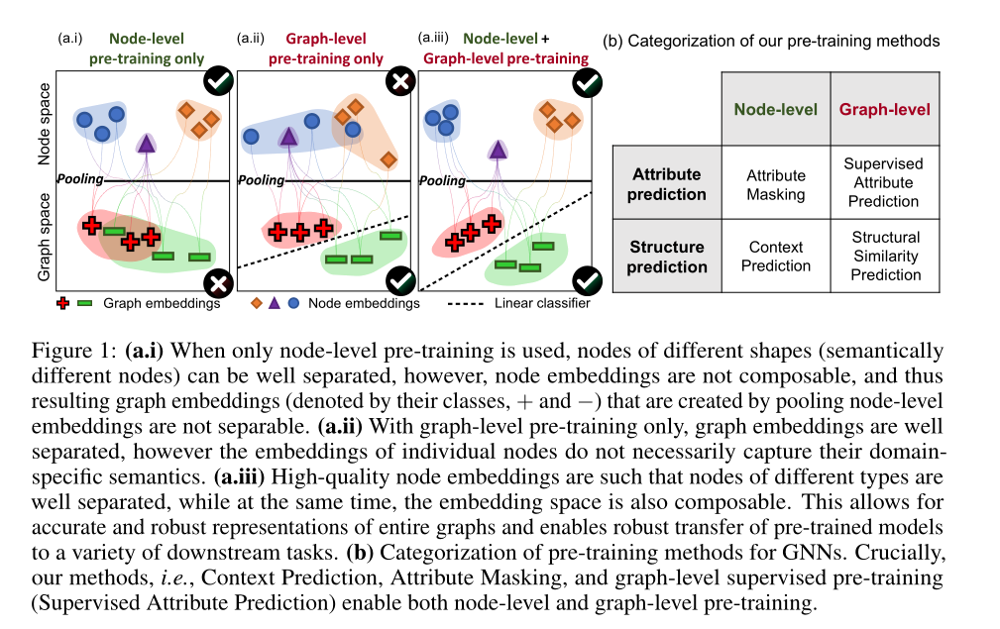
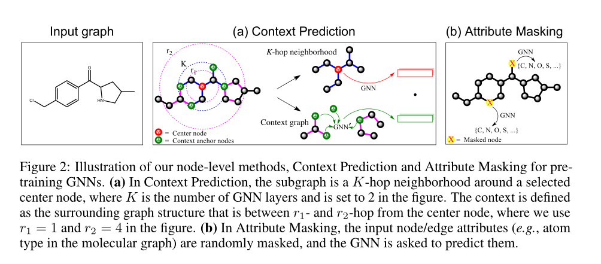
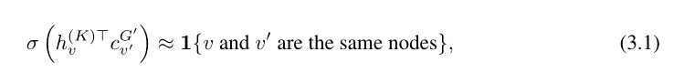
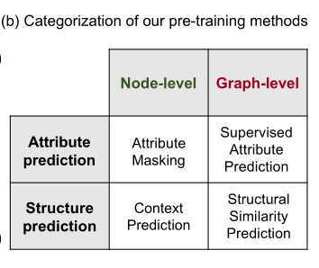

**论文名称：Strategies for Pre-training Graph Neural Networks**

**论文地址：https://arxiv.org/abs/1905.12265**

**论文简介：基于节点和图级的预训练方法解决负迁移问题**

## Abstract

本文提出了一种新的图神经网络预训练策略和自监督方法。我们的策略成功的关键是在单个节点和整个图的水平上预先训练一个有表现力的GNN，这样GNN可以同时学习有用的局部和全局表示。我们系统地研究了多图分类数据集上的预训练。我们发现当使用朴素的策略在整个图或单个节点的水平上预训练gnn时，改进非常有限，甚至可能导致许多下游任务负迁移。相比之下，我们的策略避免了负转移，并显著提高了下游任务的泛化能力，与非预训练模型相比，ROC-AUC的绝对改善高达9.4%，并在分子性质预测和蛋白质功能预测方面实现了最先进的性能。

#### 1. Introduction

介绍了迁移学习的概念，图学习的两大挑战：特定任务的标签稀缺；测试集上存在分布外样本，训练集中的图与测试集中的图在结构上非常不同，存在out-distribution prediction。

成功的迁移学习也不仅仅是增加与下游任务相同域的标记前训练数据集的数量的问题；相反，它需要大量的领域专业知识来仔细选择与感兴趣的下游任务相关的示例和目标标签。否则，知识从相关的训练前任务转移到新的下游任务会损害泛化，这被称为负迁移(Rosenstein et al.， 2005)，严重限制了训练前模型的适用性和可靠性。

工作：

(1)首次对训练前gnn的策略进行了系统的大规模调查。为此，构建了两个新的大型训练前数据集，并与社区共享:一个包含200万张图的化学数据集和一个包含395K图的生物数据集。此外，大型领域特定的数据集对调查预训练至关重要，而现有的下游基准数据集太小，无法以一种统计上可靠的方式评估模型。

(2)开发了一种有效的gnn预训练策略，并证明了其在难迁移学习问题上的非分布泛化的有效性和能力。

看似强大的训练前策略(即，使用最先进的图神经网络架构用于图级预测任务的图级多任务监督训练前策略)只带来了边际性能提升。

主要思路：节点+图，学习局部和全局的表示，最后池化得到一个图的representation（做图分类任务？）

#### 2. Related Work

一些图上的介绍：图有监督学习，图神经网络，图表示学习（READOUT）

#### 3. Method

预训练策略的技术核心是在**单个节点和整个图的级别**对GNN进行预训练。即鼓励GNN在两个级别上捕获特定于领域的语义，如图1 (a.iii)所示。这与直接但有限的训练前策略形成了对比，后者要么只使用训练前策略来预测整个图的属性(图1 (a.i))，要么只使用训练前策略来预测单个节点的属性(图1 (a.i))。

3.1 节点级别的预训练

对于节点级的gnn预训练，作者用的是无标签数据，在图中捕获领域特定的知识/规律。文章提出了上下文预测和属性屏蔽两种自监督代理任务。

3.1.1 上下文预测 探究图结构

使用子图来预测其周围的图结构。目标是预训练GNN，以便它将出现在类似结构环境中的节点映射到附近的嵌入。

**邻域和上下文图**。对于每个节点v，定义v的邻域图和上下文图：**v的K-hop邻域**包含图中距离v不超过K-hop的所有节点和边。这是由于K层GNN通过v的K阶邻域聚合信息，因此节点嵌入h(K)v依赖于距离v最多K个跃点的节点。（类似于pyg k-hop-subgraph）；将节点**v的上下文图**定义为围绕v的邻域的图结构。上下文图由两个超参数r1和r2描述，它表示距离v在r1-hop和r2-hop之间的一个子图(即它是一个宽度为r2−r1的环，大的r子图减去小的r子图)。用一个上下GNN来编码子图得到一个向量。

用word2vec中的负采样来进行学习，采样比例是1（一正一负）

3.1.2 属性掩码 探究图属性

在属性掩码中，目标是通过学习分布在图结构上的节点/边属性的规律来获取领域知识。

屏蔽节点/边缘属性，然后让gnn根据邻近结构预测这些属性(Devlin et al.， 2019)。具体地说，随机屏蔽输入节点/边缘属性，例如分子图中的原子类型，用特殊的屏蔽指示器替换它们。然后，我们应用gnn获得相应的节点/边嵌入(边嵌入可以作为边的端点节点嵌入的节点总和)。最后，在嵌入的基础上利用线性模型预测被屏蔽节点/边缘属性。与Devlin等人(2019)对句子进行操作并在令牌的全连接图上应用消息传递不同，我们对非全连接图进行操作，旨在捕捉分布在不同图结构上的节点/边属性的规律。此外，我们允许屏蔽边缘属性，而不仅仅是屏蔽节点属性。

节点和边缘属性掩蔽方法对科学领域的富注释图特别有用。例如，(1)在分子图中，节点属性对应于原子类型，捕捉它们在图上的分布使gnn能够学习简单的化学规则，如价，以及可能更复杂的化学现象，如官能团的电子或空间性质。同样，(2)在蛋白质-蛋白质相互作用(PPI)图中，边属性对应一对蛋白质之间不同种类的相互作用。通过捕获这些属性如何在PPI图中分布，gnn可以了解不同的交互是如何相互关联的。

3.2 图级别的预训练

目标是对gnn进行预训练，以生成由第3.1节中方法获得的有意义的节点嵌入组成的有用的图嵌入。目标是确保节点和图的嵌入都是高质量的，这样图的嵌入是健壮的，并且可以跨下游任务转移，如图1 (a.iii)所示。另外，图级的预训练有两种选择，如图1 (b)所示:预测整个图的特定领域属性(例如，监督标签)，或者预测图结构。

3.2.1 有监督的图属性预测

由于图级表示hG直接用于下游预测任务的微调，因此可以将领域相关信息直接编码到hG中。

通过定义有监督的图级预测任务，我们将图级领域特定知识注入到我们预先训练的嵌入中。特别地，我们考虑了一种预训练图表示的实用方法:图级多任务监督预训练来联合预测单个图的不同监督标签集。例如，在分子性质预测中，我们可以预先训练gnn来预测迄今为止实验测量到的分子的所有性质。在蛋白质功能预测中，我们的目标是预测给定的蛋白质是否具有给定的功能，我们可以预训练gnn来预测到目前为止已经验证的各种蛋白质功能的存在。在第5节的实验中，我们准备了一系列不同的监督任务(多达5000个任务)来模拟这些实际场景。关于监督任务和数据集的更多细节在5.1节中描述。为了联合预测多个图属性，其中每个属性对应一个二元分类任务，在图表示上应用线性分类器。

存在的问题：对于领域适应的预训练任务可能在其他任务上会出现负迁移的现象，一种解决方案是选择“真正相关的”有监督的预训练任务，并只在这些任务上预训练gnn。然而，这样的解决方案成本极高，因为选择相关的任务需要大量的领域专业知识，并且需要针对不同的下游任务分别进行预培训。

为了缓解这个问题，文章给出的解决办法是多任务监督预训练只提供图级监督;因此，创建图级嵌入的本地节点嵌入可能没有意义，如图1 (a.i)所示。这种无用的节点嵌入会加剧负迁移的问题，因为许多不同的预训练任务更容易在节点嵌入空间中相互干扰。基于此，我们的预训练策略是在进行图级预训练之前，首先通过3.1节所述的节点级预训练方法对单个节点级的gnn进行正则化。正如我们经验证明的那样，组合策略产生了更多可转移的图表示，并在无需专家选择有监督预训练任务的情况下，稳健地提高了下游性能。

第二种方法是定义一个图级预测任务，目标是**为两个图的结构相似性建模**。这类任务的例子包括对图编辑距离建模(Bai等人，2019年)或预测图结构相似性(Navarin等人，2018年)。然而，寻找正确的图的距离值是一个困难的问题，在大型数据集中需要考虑的图对的数量是幂级的。因此，虽然这种类型的预培训也是非常自然的，但它超出了本文的范围，我们将其研究留给未来的工作。

综上所述，我们的预训练策略是：

1.先进行节点级的自监督预训练(章节3.1)，再进行图级多任务监督预训练(章节3.2)。当GNN预训练完成后，在下游任务上对预训练的GNN模型进行微调。具体来说，我们在图级表示的顶层添加了线性分类器来预测下游的图标签。

2.完整流程fine-tune，即预训练的GNN和下游线性分类器，随后以端到端方式进行微调。时间复杂度分析在附录F中提供，其中我们展示了我们的预训练方法在gnn中转发计算时产生的计算开销很少。

一些作者的说明：关于图中**单个节点的无监督表示学习**有丰富的文献，大致分为两类。第一类是使用**局部随机行走目标**的方法(Grover & Leskovec, 2016;Perozzi等人，2014;Tang等人，2015)和重构图邻接矩阵的方法，例如，通过预测边的存在性(Hamilton等人，2017a;Kipf & Welling, 2016)。第二类是一些方法，如Deep Graph Infomax (V eliˇckovi´c et al.， 2019)，它训练一个节点编码器，使本地节点表示和池化的全局图表示之间的相互信息最大化。所有这些方法**都鼓励附近的节点有相似的嵌入**，最初提出和评估的节点分类和链接预测。然而，这对于图级预测任务来说可能不是最优的，**在图级预测任务中，捕捉局部邻域的结构相似性往往比捕捉图中节点的位置信息更重要**(Y ou等人，2019;Rogers & Hahn, 2010;Y ang等人，2014)。因此，我们的方法同时考虑了节点级和图级的预训练任务，正如我们在实验中所示，为了让预训练模型获得良好的性能，使用这两种类型的任务是必要的。

#### 4. Experiments

#### 5. Discussion and Conclusion

观察(1):表2显示了表达能力最强的GNN架构(GIN)，在经过预训练后，在跨领域和数据集方面取得了最好的性能。与GIN架构获得的训练前收益相比，使用表达能力较低的gnn (GCN、GraphSAGE和GA T)进行预训练收益更小，有时甚至是负的(表2)。这一发现证实了之前的观察结果(例如，Erhan等人(2010))，encoder的重要性，并且在表达能力有限的模型上使用预训练甚至会损害性能，如GCN、GraphSAGE和GAT（读进去了噪声？）

观察(2):从表1的阴影单元格和图3中间面板的突出区域可以看出，强基线策略对gnn进行广泛的图级多任务监督预训练，其性能提高令人惊讶地有限，并在许多下游任务上产生负转移(分子预测8个数据集中的2个，蛋白质功能预测40个任务中的13个)。

观察(3):从表1的上半部分和图3的左面板，我们可以看到另一个基线策略，它只执行节点级的自监督预训练，也提供了有限的性能提升，与图级多任务监督预训练基线相当。

观察(4):从表1的下半部分和图3的右侧面板，我们可以看到我们的训练前策略，结合图级多任务监督和节点级自监督的预训练策略，避免了跨下游数据集的负迁移，取得了最好的性能。

观察(5):此外，从表1和图3的左面板中，我们看到我们的策略比两种基线预训练策略和非预训练模型具有更好的预测性能，达到了最先进的性能。

在我们的初步实验中，我们同时对gnn进行了属性掩蔽和上下文预测的预训练。在我们的实验中，这种方法并没有提高性能。我们将对该方法的深入分析留到以后的工作中。

我们为训练前的gnn开发了一种新的策略。我们的策略成功的关键是将节点级和图级的预训练与表达GNN结合起来考虑。

这确保了节点嵌入捕获了聚集在一起以获得有意义的图级表示的本地邻域语义，而这些语义反过来又用于下游任务。

在多个数据集、不同的下游任务和不同的GNN架构上的实验表明，新的预训练策略比非预训练模型具有更好的分布外泛化效果。

我们的研究为图解迁移学习迈出了重要的一步，解决了之前研究中观察到的负迁移问题。未来的工作有很多有趣的途径。例如，通过改进GNN架构以及训练前和微调方法来进一步提高泛化是一个富有成效的方向。调查预先训练的模型已经学习了什么也将有助于科学发现(Tshitoyan等人，2019年)。最后，将我们的方法应用到其他领域会很有趣，如物理、材料科学和结构生物学，其中许多问题是通过表示原子、粒子和氨基酸等相互作用的图形来定义的。