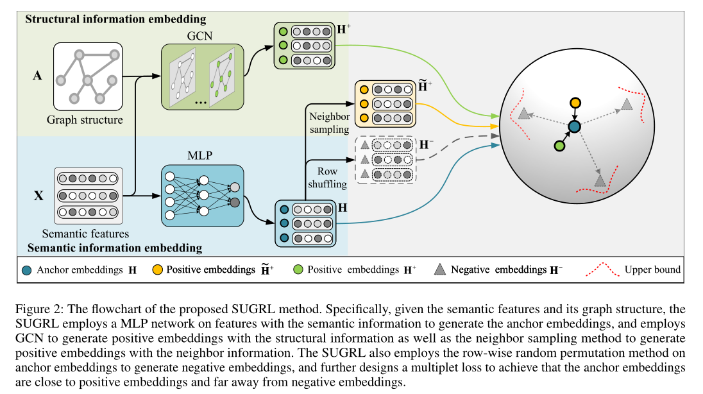
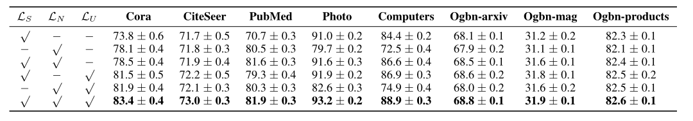
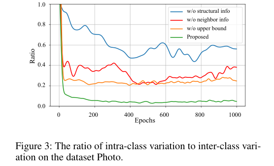

**论文名称：Simple Unsupervised Graph Representation Learning**

**论文地址：https://www.aaai.org/AAAI22Papers/AAAI-3999.MoY.pdf**

**论文简介：提出了高效的图对比学习方法**

## Abstract

在loss上进行了改进，探索图结构信息和邻居节点信息之间的互补特性增大类间距离，引入上界损失减少类内距离，去除了广泛使用的数据增强和鉴别器，同时可以输出低维嵌入，从而得到了一个高效的模型。

#### 1. Introduction

​	现有的方法存在的问题：列举了（DGI, GMI, GRACE, GCA）他们都是通过最大化互信息的形式，因此势必要采用增强方法出不同的层次进行互信息计算。这些方法很吃资源（增强代价高，嵌入维度高，对比loss算起来复杂）-》motivation：能不能做一个简单的图对比学习算法？

#### 2. Related Work

​	对比学习通过正面和负面样本的对比来学习辨别性表征。这些方法通常鼓励编码器通过最大化输入和被学习的表示之间的互信息来学习表示。列举了 CPC，DIM，CMC，SimCLR，MoCo。

​	无监督的图表示学习：DGI，GIC，GMI，GRACE，GCA，MVGRL

#### 3. Method

1. 去掉了图增强和discriminator
2. 去掉了GCN作为encoder，只用了个MLP。

​    学不到东西怎么办？

​	解决办法：设计了新的multiplet loss，联合考虑结构信息和邻居信息，探索它们的互补信息，旨在扩大类间差异，并设计一个上限损失，减小类内差异。

具体的：对于anchor的计算：

$\mathbf{X}^{l+1} = Dropout \left( {\sigma \left( \mathbf{X}^{\left(l\right)}\mathbf{W}^{\left(l\right)} \right) } \right)$

$\mathbf{H} = \mathbf{X}^{\left( l+1 \right)}\mathbf{W}^{\left( l+1 \right)}$

对于负样本的生成：

$\mathbf{H}^- = Shuffle\left( \left[ \mathbf{h}_1, \mathbf{h}_2,\dots, \mathbf{h}_N \right]\right)$

对于正样本的生成：

1. 考虑结构信息（GCN去抽取，W作为共享参数）：

   $\displaystyle {\mathbf{H}^{+}}^{\left(l+1\right)}= \sigma\left( \widehat{\mathbf{A}}{\mathbf{H}^{+}}^{\left( l\right)}\mathbf{W}^{\left(l\right)} \right)$
   
2. 考虑邻接信息（1-hop）

   $\displaystyle \widetilde{\mathbf{h}}_{i}^{+} = \frac{1}{m} \sum_{j=1}^{m}\left\{ \mathbf{h}_j\;|\;v_j \in \mathcal{N}_i \right\}$ 

减少泛化误差对UGRL很重要，因为训练过程中的小泛化误差可能会提高对比学习的泛化能力(Xuan et al. 2019)。此外，无论是减少类内差异还是扩大类间差异都已被证明是减少泛化误差的有效解决方案(Wen et al. 2016)。

引入triplet loss，设计了一个上限损失来去除鉴别器(效率)，减少类内差异，扩大类间差异(有效性)。

具体来说，三元组相对于每个样本的损失可以表述为：

$\alpha+d\left(\mathbf{h}, \mathbf{h}^{+}\right)<d\left(\mathbf{h}, \mathbf{h}^{-}\right)$

把所有负样本损失进行累加

$\displaystyle \mathcal{L}_{\text {triplet }}=\frac{1}{k} \sum_{i=1}^k\left\{d\left(\mathbf{h}, \mathbf{h}^{+}\right)^2-d\left(\mathbf{h}, \mathbf{h}_i^{-}\right)^2+\alpha\right\}_{+}$

$\{\cdot\}_{+}=\max \{\cdot, 0\}$

为了增加类间差异，应该将正样本与负样本进行推开，分别考虑结构正样本和邻接正样本：

$\begin{aligned} \mathcal{L}_S &=\frac{1}{k} \sum_{i=1}^k\left\{d\left(\mathbf{h}, \mathbf{h}^{+}\right)^2-d\left(\mathbf{h}, \mathbf{h}_i^{-}\right)^2+\alpha\right\}_{+}, \\ \mathcal{L}_N &=\frac{1}{k} \sum_{j=1}^k\left\{d\left(\mathbf{h}, \widetilde{\mathbf{h}}^{+}\right)^2-d\left(\mathbf{h}, \mathbf{h}_j^{-}\right)^2+\alpha\right\}_{+} . \end{aligned}$

好处：其中一个为0的时候另一个也有可能是非0，所以负样本被推开的概率增大了（把$d\left(\mathbf{h}, \mathbf{h}^{+}\right) - d\left(\mathbf{h}, \mathbf{h}^{-}_{i}\right) $看成一个整体，继续进行优化，可以提升类间性能）

可能存在的问题：类内差距太大呢？$d\left(\mathbf{h}, \mathbf{h}^{+}\right)$ 这一项太大，类内差距太大，没得到优化，所以也要精心设计一下，因此设计了个上界：

$\alpha+d\left(\mathbf{h}, \mathbf{h}^{+}\right)<d\left(\mathbf{h}, \mathbf{h}^{-}\right)<d\left(\mathbf{h}, \mathbf{h}^{+}\right)+\alpha+\beta$,

$\displaystyle\mathcal{L}_U=-\frac{1}{k} \sum_{i=1}^k\left\{d\left(\mathbf{h}, \mathbf{h}^{+}\right)^2-d\left(\mathbf{h}, \mathbf{h}_i^{-}\right)^2+\alpha+\beta\right\}_{-}$

$\{\cdot\}_{-}=\min \{\cdot, 0\}$

另一方面，如果公式$L_S$，$L_N$不断拉远负样本，相当于给正样本（无论哪一种）更大的距离空间（和anchor的距离），毕竟triplet是用负样本的距离作为正样本距离的bound。因此，作者利用如下图所示的loss的对负样本（以及正样本）的距离进行约束，使得这个距离不会无限大，减小类内差异。其中，β可以理解为upper bound margin。

我自己的理解：如果只是单纯的使用

$d\left(\mathbf{h}, \mathbf{h}^{+}\right)<d\left(\mathbf{h}, \mathbf{h}^{-}\right)$

模型容易坍塌，直接让类内差距不存在就可以简单的满足这个条件了。

加个 $\alpha$ ，让模型去真正学习类内差距小于类间差距：（二个思路，减小d+，拉大d-）其实这种情况在大部分情况下已经可以满足类内小，类间大了，因此往往来说正样本和锚点的差距不会太大，所以初始的情况d+就不会太大，模型优化的方向是向拉大d-进发的。而这里之所以要精挑细选[注解1]，再次优化类内差距，可能是因为锚点是mlp出来的，而正样本是GCN出来的，这两个之间的差距会大于相对于原本的增强方法出来锚点与正样本的差距，所以加个上界变成$L_U$的形式，让里面的项朝大于0的方向走，可以让d-不至于走向太大，从而在上一步的优化中尽量优化d+往小的方向走。 

注解1：而对于用锚点的neighbor得到的正嵌入，实验上并不好，与我们上文说到的类似，此时d+本身已经较小了，最后精挑细选影响不大。

最后的loss综合三部分：

$\mathcal{L}=\omega_1 \mathcal{L}_S+\omega_2 \mathcal{L}_N+\mathcal{L}_U$,

#### 4. Experiments

1. 没有结构或邻居信息的方法通常输出更大的比率(即更小的类间差异)。

2. 无上界的方法，会输出更大的比率(即更大的类内差异)。即验证结构信息、邻居信息或上界信息的有效性。

#### 

#### 参考：

https://zhuanlan.zhihu.com/p/493269474

https://www.cnblogs.com/BlairGrowing/p/16049760.html