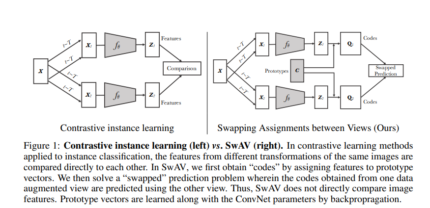
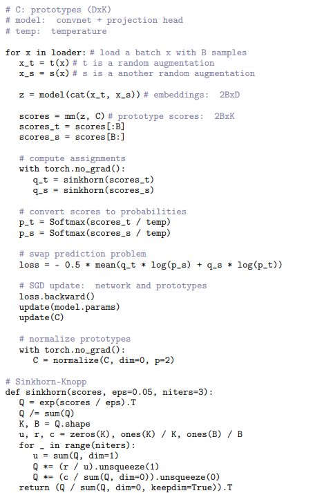
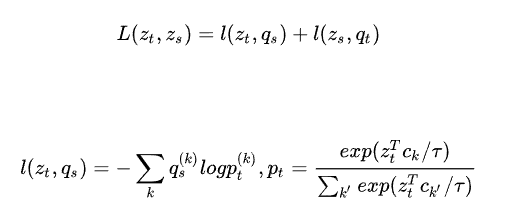

**论文名称：Unsupervised Learning of Visual Features by Contrasting Cluster Assignments**

**论文地址：https://arxiv.org/abs/2006.09882**

**论文简介：无需负样本，基于聚簇的视觉自监督学习**

## Abstract

传统的对比学习方法是对不同增强出来的feature进行比较，计算量比较大

SwAV（Swapping Assignments between multiple Views of the same images）也就是交换不同view下图片的cluster assignments；同一图片经过数据增强以后得到两个views，然后SwAV通过view A的code（这里的“code”就是指cluster assignment）预测view B的representation，通过view B的code预测view A的representation；

除了引入聚类以外，SwAV还提出了一种“multi-crop”的图像变换方法，进一步提升了效果。

**对各类样本进行聚类，然后去区分每类的类簇**，类似于给定负样本的先验，把同一类的拉近

具体做法：

1. 用K个点C = c1, c2 ... ck表示聚类的中心（维度为(d, k)）
2. 对于一个batch内样本的x生成encoding Z = z1, z2 ... zb（维度为(b, d)）
3. 将Z通过聚类中心映射成新的向量表示 Q，Q的维度为 (b, k), $q_{bk}$相当于第b个样本与第k个聚类中心的相似度，理想情况下，样本与自己的类簇中心相似度为1，与其他的为0
4. 将同一张图片不同view所产生的 $z$ 和 $q$ 进行相互预测

对于Q（k,b）就是batch个样本各自属于哪个聚簇中心的标签

思考：为什么没加负样本有效？不会得到只是趋于alignment的特征吗

第三步映射得到的Q其实相当于一个soft label，可以指导特征空间之间的区分，相当于提供了uniformity信息

