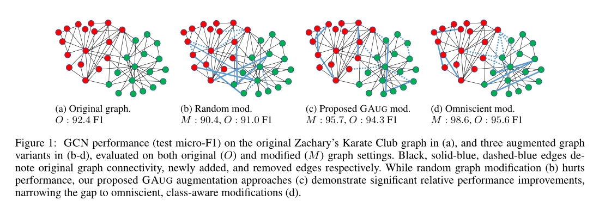
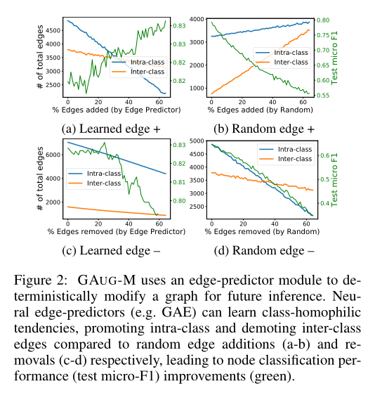
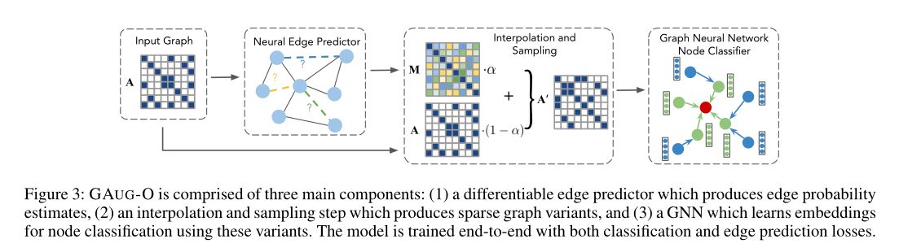
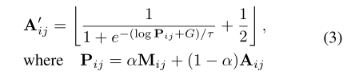
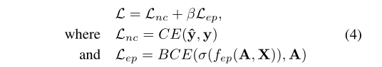

**论文名称：Data Augmentation for Graph Neural Networks**

**论文地址：https://arxiv.org/pdf/2006.06830.pdf**

**论文简介：提出 GAUG 图数据增强框架，利用 edge predictor 实现基于 GNN 半监督节点分类任务的数据增强**

## Abstract

数据增强技术已被广泛用于提高机器学习模型的可泛化性。然而，研究图的数据增强的工作相对较少。这主要是由于图的复杂的非欧氏结构限制了可能的操作。在视觉和语言中常用的扩充操作在图形中没有类似的运算。本文的工作是在改进半监督节点分类的背景下，研究图神经网络(GNNs)的图数据增强。文章提出：基于神经网络的边预测器可以有效地编码类间结构，以提高给定图结构中的类内边和降级类间边。文章提出来了GAUG图数据增强框架，该框架利用这些洞察力通过边预测提高基于gnn的节点分类的性能。在多个基准测试上的大量实验表明，通过GAG进行增强可以提高GNN体系结构和数据集的性能。

#### 1. Introduction

GNN为什么做数据增强的少？一个主要的障碍是，与其他数据的结构是通过位置编码的相比，图的结构是通过节点连通性编码的（邻接矩阵），这是不规则的。因此，CV和NLP中经常使用的手工制作的、结构化的数据扩充操作无法应用。此外，这种不规则性并不容易定义新的增强策略。现今策略？

最明显的方法是添加或删除节点或边。

对于节点分类任务（论文关注的task），增加节点在标记和计算新节点的特征和连通性方面存在挑战，而删除节点只会减少可用数据。因此，边的添加和删除是图的最佳增强策略。但问题依然存在，如何加减边？

#### 2. Related Work

三个work

dropedge：类似于dropout，但是只用了删边没用加边

adaedge：根据置信度在预测为相同（不同）标签的节点之间迭代加（删）边，容易错误传播

BGCN迭代训练带有GCN，以生成多个去噪图，集成结果来自多个GCN。也有错误传播的风险。

#### 3. Method 基于边操作的图数据增强

作者讨论了如何通过删除“噪声”边和添加原始图中可能存在的“缺失”边来促进消息传递，从而提高GNN的性能，以及它与类内和类间边的关系。

实践中存在的问题：图可能不是完美图（噪声，eg:垃圾邮件，社交图，论文忽略了引用一篇文章）

在理想情况下可以产生一个图Gi，其中补全了应该存在但是忽略了的边关系，删除了不相关/不重要但是实际存在的边关系。基于图 1 的实验结果策略性地在同一类簇内的节点之间添加边并且在不同类簇内的节点之间移除边可以显著提高了节点分类的测试性能。直观地说，这个过程鼓励同类节点嵌入的平滑性，并区分其他类节点嵌入，从而提高了区别性。（得到一个理想类同质图有助于节点分类器的训练但是也会产生过拟合问题，太偏向于Gi,泛化到G上效果不一定好）

提升类内边缘和降低类间边缘的策略边缘操作使得训练中的类区分在GNN中变得微不足道，当使用标签全知时。考虑一种极端情况，其中所有可能的类内边和类间边都不存在，图可以被视为k个完全连接的组件，其中k为类的数量，每个组件中的所有节点都有相同的标签。然后通过定理1(在补充材料A.1节(Zhao et al. 2020b)中证明)，gnn可以很容易地在不同的类之间生成不同的节点表示，对所有同类节点具有等价表示。在这种“理想图”场景下，可以毫不费力地对学习过的嵌入进行分类。

基于图数据增强任务，本文提出两种策略：

（1）应用一个或多个图变换操作：$f: \mathcal{G} \rightarrow \mathcal{G}_m$ ，其中在训练或者测试推理的过程中都使用 $\mathcal{G}_m$ 替代 $\mathcal{G}$ ，称为 modified-graph setting；

（2）应用多种转换操作：$f_i: \mathcal{G} \rightarrow \mathcal{G}_m^i , i=1 \ldots N$，在该过程中 $\mathcal{G} \cup\left\{\mathcal{G}_m^i\right\}_{i=1}^N$ 被用于训练但是只有 $\mathcal{G}$ 被用于测试推理过程，称为 original-graph setting。

作者认为在给定的图在推理过程中不变的情况下，modified-graph setting 是最合适的。当必须在动态图上进行推断时，其中在推理期间用 $\mathcal{G}_m$ 校准新的图连通性是不可行的情况下，则 original-graph setting 更合适。本质原因为在推理过程中应用数据增强的可行性，以避免 train-test gap。

基于此作者提出 GAUG，其关键思想是利用图中固有的信息来预测哪些不存在的边可能存在，哪些存在的边可能被移除进而产生修正后的图表示为 $\mathcal{G}_m$ 进而提升模型性能

上文中作者为图数据增强任务所定义的两种策略：

（1）为modified-graph setting 设计的 GAUG-M 方法，包含以下两个步骤：

1. 使用 edge predictor 来获得 G 中所有可能的和现有 edge 的 edge probabilities。 edge predictor 的作用是灵活的，通常可以用任何合适的方法来代替。
2. 基于得到的 edge probabilities 来对图中的边信息进行修正得到 $\mathcal{G}_m$，用作GNN节点分类器的输入

其中的核心步骤为 edge predictor，形式化表述为 $\mathcal{f}_{ep}:\bold{A},\bold{X}→\bold{M}$ ，其中 $\bold{M}$ 表示为边的概率矩阵其中 $\bold{M}_{uv}$ 反应节点 u,v 之间存在边的概率大小，本文使用 GAE 中的卷积模块作为 edge predictor module：GAE由一个两层GCN编码器和一个内积解码器组成

​									$\mathbf{M}=\sigma\left(\mathbf{Z Z}^T\right)$, where $\mathbf{Z}=f_{G C L}^{(1)}\left(\mathbf{A}, f_{G C L}^{(0)}(\mathbf{A}, \mathbf{X})\right)$

令 |E| 代表图中边的数量，GAUG-M 增加前 i|E| 个原本不存在边但是取得了高边概率预测值的的节点对，删除 j|E| 个原本存在边但是只得到了低边概率预测值的节点对。在该过程中取值为 i,j∈[0,1] ，经过上述过程修正完的图表示为 $\mathcal{G}_m$ 。这个过程等价为一个去噪的过程，随着这个过程，类簇内边的概率迅速增加，类簇间边的概率缓慢增加

（2）为Original-Graph Setting 设计的 GAUG-O 方法，包含以下两个步骤：

GRAG-O 不需要离散的边指定来添加/删除边，整个过程是端到端可训练的，并且利用 edge predictor 和节点分类损失来迭代地提高 edge predictor 的扩展能力和节点分类器 GNN 的分类能力。

本文基于 GAE 模块的 edge predictor 首先得到 M 并通过原始的邻接矩阵 A 来得到派生的邻接矩阵关系矩阵 P 。（目的：为了防止边缘预测器任意偏离原始图邻接关系，对M和A进行插值，得到邻接矩阵P）。在边采样阶段，对每条边进行 Bernoulli 采样，对 P 进行稀疏处理，得到图的邻接关系 A′ 。出于训练目的，作者采用 (soft,differentiable) 松弛伯努利抽样过程作为伯努利近似。这种松弛是 Gumbel-Softmax 再参数化技巧的二进制特殊情况。使用松弛样本，应用 straight-through (ST) 梯度估计器，它在正向传递中对松弛样本进行舍入，此后精简邻接。在后向传递中，梯度被直接传递给松弛的样本，而不是返回的值，从而实现训练：

其中 A′ 代表采样后的邻接矩阵， τ 代表 Gumbel-Softmax distribution， G∼Gumbel(0,1) 的一个随机变量， α 代表超参，进而损失函数为节点分类损失和边预测损失的叠加：

参考资料：

https://zhuanlan.zhihu.com/p/466617745

