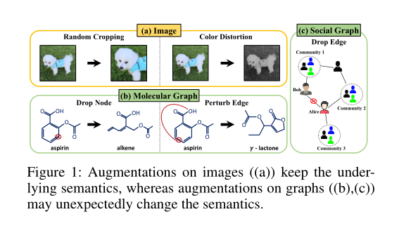
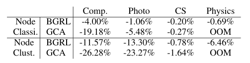
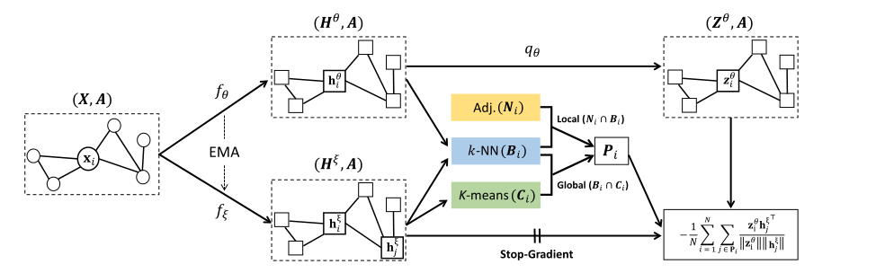
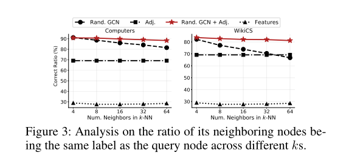
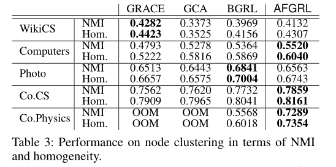
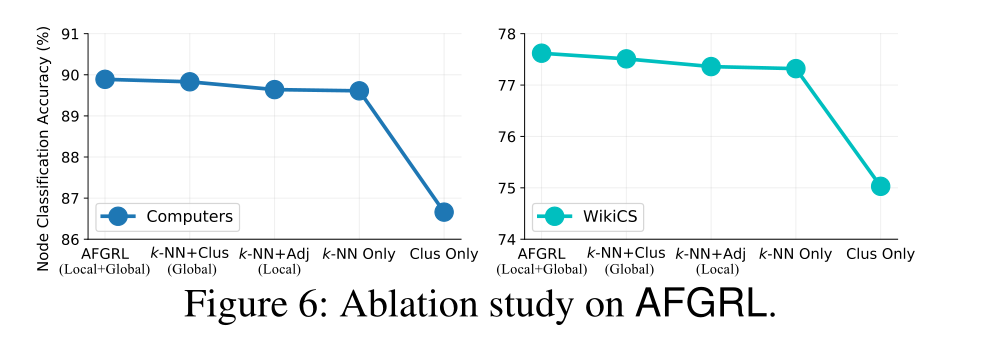
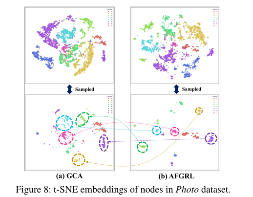

**论文名称：Augmentation-Free Self-Supervised Learning on Graphs**

**论文地址：https://arxiv.org/pdf/2112.02472.pdf**

**论文简介：BGRL去掉增强方法来训练自监督模型**

## Abstract

现有对比学习：依赖增强方法；如果没有精心设计的增强技术，结果会产生比较大的变化-》图的底层语义可能会发生巨大的变化。现有基于增广的方法的性能高度依赖于增广方案的选择，**即与增广相关的超参数**

在本文中，作者提出了一种新的图的无增强自监督学习框架，称为AFGRL。

具体来说，作者通过**图的共享局部结构信息和全局语义的节点**来生成图的替代视图。(新的正样本的设计方式。）

针对各种节点级任务(即节点分类、聚类和在各种真实数据集上的相似性搜索)做了实验，达到SOTA

#### 1. Introduction

首先介绍为什么增强方法不好。

CV里面的增强都很自然，对语义信息不会改变，即使语义发生了变化，人类也可以很容易地从视觉上识别出变化，并选择一种保留语义的替代增强方法。

而图上：

当我们扰动(删除或添加)图的边/节点及其特征时，无法确定增广图是否与原始图正相关，由于图难以可视化，验证增广图的有效性并非易事。

例如，在分子图中，从阿司匹林的苯环上掉落一个碳原子会破坏芳香族系统，形成烯烃链(图1(b))。此外，扰乱阿司匹林的连接可能会引入一种完全不同性质的分子，即五元内酯(Sun et al 2021a)。社交图中，随机删除边也可能导致语义变化，特别是当这些边与枢纽节点相关时。

如果Bob和Alice之间的边被去掉，Bob到达Community 3需要更长的距离(即从2跳到5跳)，这也改变了Community 1和Community 3之间的关系。这主要是因为图不仅包含语义信息，还包含结构信息。

此外，CV的对比学习做的都是实例判别的任务，把除正样本之外的图片当作负样本。但在图上，这种方法忽略了图的结构信息，因此无法从图结构数据的关系归纳偏差中受益。

eg：最好和最坏增强参数之间的差异

因此，作者在BGRL不要负样本的基础上，不要增强，手工构造增强图！

#### 3. Method

使用原始图本身作为一个视图，并通过在表示空间中通过k-近邻(k-NN)搜索发现对于原始图中的每个节点，可以作为正样本的节点来生成另一个视图。然后，给定两个语义相关的视图，我们的目标是预测第一个视图中的每个节点在第二个视图中的正样本节点的潜在表示。

基于k-NN搜索选择相似度高的节点集合Bi作为正样本，来生成替代视图。

这种方法会有噪声：可能查询到的节点是语义无关的？忽略了图结构信息；

因此，作者引入了一种机制，从k-NN搜索发现的样本中过滤假阳性。

即选择正样本的方法更为复杂，Bi还要满足两个条件之一：

1)它是邻接矩阵中目标节点的相邻节点(局部视角)，捕获图结构数据中固有的关系归纳偏差。

2)它与目标节点属于同一个集群(全局视角)，这一步通过k-means获得。

存在的问题：为什么KNN相似度高的就可以作为正样本？看比例，发现KNN搜出来前几的节点都和anchor标签一样的比例很高。但还是有噪声！

再进行约束：对于节点vi，其相邻节点Ni倾向于与vi共享相同的标签。因此两个一起结合，构造的正样本如图3红色线所示。因为方案1的motivation就很明确了。

对于方案2，聚类方法的直观表现是发现与查询节点共享全局语义信息的非相邻节点。

举了个例子：

在一个学术合作网络中，节点表示作者，边表示作者之间的合作，即使两个作者从事同一研究主题(即相同的标签)，他们也可能在图中没有连接，因为他们过去没有合作过，也没有共享任何合作者。作者认为，这种语义相似但不共享边缘的实体可以通过全局视角的聚类来发现。

所以将所有节点进行k-means聚类，认为在一个类簇里面的是共享相同全局语义信息的，所以和anchor在一个簇里的也与Bi取交集。

最终，正样本为：
$$
\mathbf{P}_i=\left(\mathbf{B}_i \cap \mathbf{N}_i\right) \cup\left(\mathbf{B}_i \cap \mathbf{C}_i\right)
$$
对比损失也是BGRL的loss：
$$
\mathcal{L}_{\theta, \xi}=-\frac{1}{N} \sum_{i=1}^N \sum_{v_j \in \mathbf{P}_i} \frac{\mathbf{z}_i^\theta \mathbf{h}_j^{\xi \top}}{\left\|\mathbf{z}_i^\theta\right\|\left\|\mathbf{h}_j^{\xi}\right\|},
$$

#### 4. Experiments

聚类实验：

说明图实例判别不适合聚类任务，聚类任务对全局结构信息比较敏感。

消融实验：

从每个标签中选取相同的节点集，并比较它们的嵌入：

与GCA相比，AFGRL中的节点分组更紧密，这意味着AFGRL捕获了更细粒度的类信息。

#### 5. Discussion and Conclusion

参数？ K(K-means), k(k-nn), M(K-means聚类的次数)；

pe1, pe2, pf1, pf2

