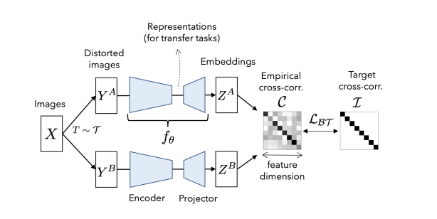

**论文名称：Barlow Twins: Self-Supervised Learning via Redundancy Reduction**

**论文地址：https://arxiv.org/abs/2103.03230**

**论文简介：冗余减少原则的自监督学习方法**

## Abstract

学习表征对于增强的不变性-》容易陷入常数解-》设计方法来避免模型坍塌

使用一种新的视角去学习表示，从embeddig本身出发，而不是从样本出发。优化目标是为两个增强之后的图像输入encoder后得到的嵌入生成互相关矩阵**，使其尽可能地接近单位矩阵，**让不同的维度的特征尽量表示不同的信息，降低特征之间的冗余度。

$$
\mathcal{L}_{\mathcal{B} \mathcal{T}} \triangleq \underbrace{\sum_i\left(1-\mathcal{C}_{i i}\right)^2}_{\text {invariance term }}+\lambda \underbrace{\sum_i \sum_{j \neq i} \mathcal{C}_{i j}{ }^2}_{\text {redundancy reduction term }}
$$
其中：

$$
\mathcal{C}_{i j} \triangleq \frac{\sum_b z_{b, i}^A z_{b, j}^B}{\sqrt{\sum_b\left(z_{b, i}^A\right)^2} \sqrt{\sum_b\left(z_{b, j}^B\right)^2}}
$$

使用这种思路优化得到的编码器也能得到良好的特征。

直观上的解释，这种优化思路相当于将InfoNCE所优化的样本相关阵接近恒等矩阵：$Z_a * Z_b{ }^T \rightarrow \mathcal{I}_N$ 转换为了特征相关阵接近恒等矩阵：$Z_a^T * Z_b \rightarrow \mathcal{I}_D$，在特征维度隐式地提供了负样本，从而无需实例级别的负样本。