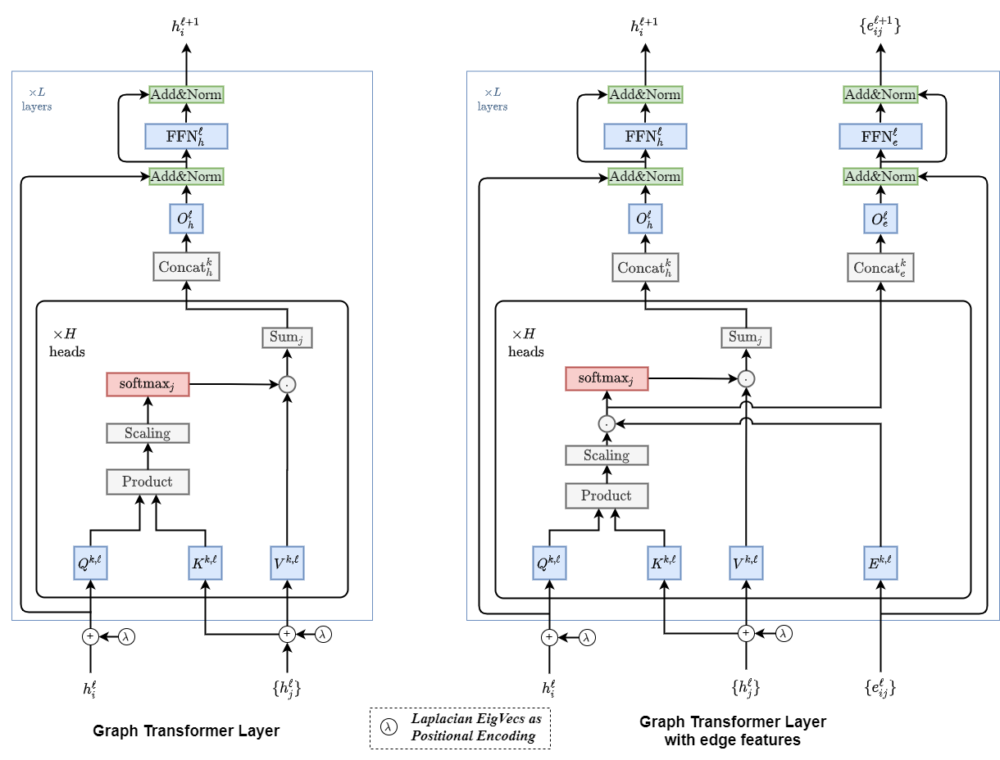

**论文名称：A Generalization of Transformer Networks to Graphs**

**论文地址：https://arxiv.org/abs/2012.09699**

**论文简介：**

## Abstract

图数据拥有两个特性：(1)稀疏性。(2) 结点间有拓扑关系。这两个特性对于图来说非常重要，但是在利用transformer去处理图数据时，由于在任意两个结点之间建立了联系，因此可以说忽略了图的稀疏性和拓扑关系这两个特性，因此作者想设计一种基于图的transformer，在保留图的特性的时候，依旧能够利用transformer去处理。

两个版本：加边属性进去与不加边属性；

把layernorm换成了batchnorm；

加入了拉普拉斯矩阵分解的结果作为position encoding

