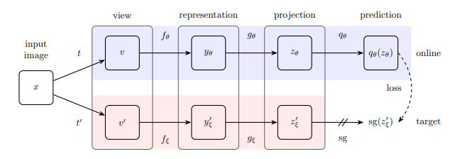
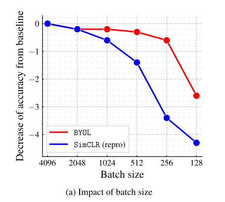
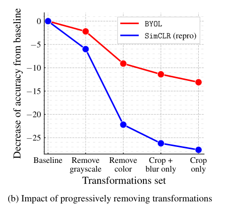
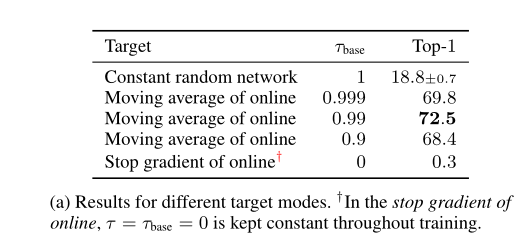
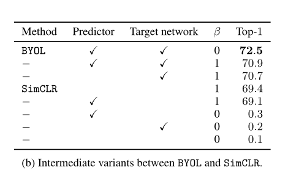

**论文名称：Bootstrap your own latent: A new approach to self-supervised Learning**

**论文地址：https://arxiv.org/abs/2006.07733**

**论文简介：无需负样本的自监督学习方法**

## Abstract

提供online network和target network， 通过增强方法，训练online网络来预测同一图像在不同增强视图下的target表示。用EMA的online网络缓慢更新target网络。

实验消融细节：

**batch size消融：**

Drop程度很低，说明batch的影响不大（为什么还是会有影响呢？因为encoder里面和projection都有batch norm）

**增强消融：对于增强也相对更鲁棒：**

why？

SimCLR在从图像增强中去除颜色失真时工作得不好。

只用crop时，同一图像的crop（截取原图片的一个固定大小的patch）大部分共享它们的颜色直方图。同时，颜色直方图在不同的图像上一般是不同的。

因此，当一项对比任务仅依赖crop作为图像增强时，主要可以通过单独关注颜色直方图来解决。因此，学到的嵌入可以会偷懒只学到保留颜色直方图的信息。

为了防止这种情况，SimCLR在其图像增强集中添加了颜色失真。

相反，BYOL鼓励所有信息都保存到online encoder中，再去对齐target encoder。

因此，即使同一图像的增强视图共享相同的颜色直方图，BYOL仍然会在其表示中保留额外的特征

**EMA的动态更新率消融：**

target = tau * target + (1 - tau) * online

$\tau = 0$ 是立刻更新，$\tau = 1$ 相当于去对齐随机初始化的网络

**BYOL与SimCLR的对比**

其中$\beta$ 表示需不需要simclr里的负样本

对比72.5和0.2， 0.3可以看到，predictor和target network还是很重要的，可以在没有负样本的情况下scatter开特征；

考虑第一和第二行，不显式添加负样本效果更好（增大negative sample这一操作也许是hand crafted 的，用BN去scatter不同点的feature，更能学到不同image的关系）