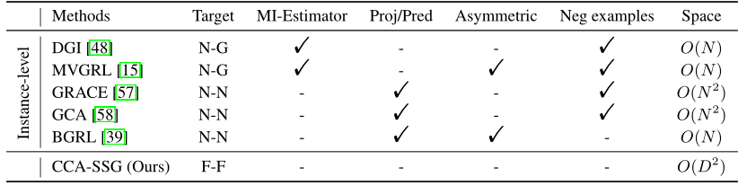
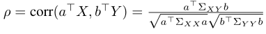
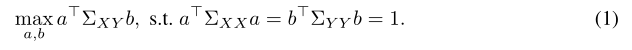
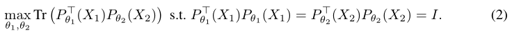
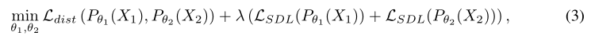
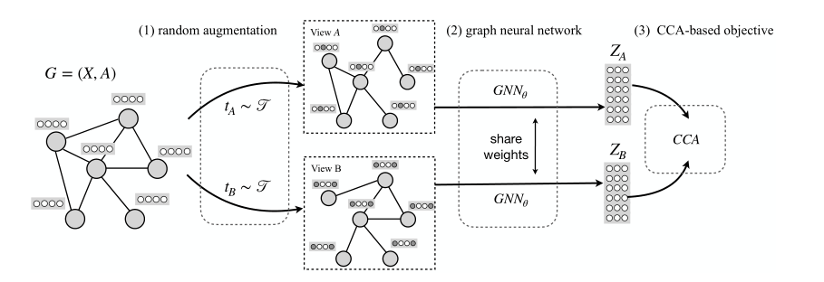
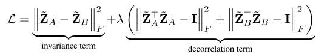
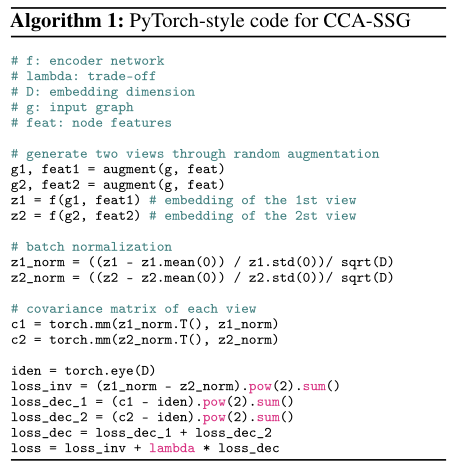

**论文名称：From Canonical Correlation Analysis to Self-supervised Graph Neural Networks**

**论文地址：https://arxiv.org/abs/2106.12484**

**论文简介：基于相关分析的自监督图神经网络**

## Abstract

论文提出的模型遵循前面通过数据增强生成输入图的两个视图的方法。

与专注于实例级区分的对比方法不同，文章优化了受**经典相关分析**启发的创新特征级目标。与其他工作相比，作者提出的方法不需要参数化互信息估计器、额外的projector、不对称结构，最重要的是，也不需要代价高昂的负样本。

作者表明，新的目标本质上是：

1)旨在通过学习不变表示，丢弃增强过程引入的变量信息

2)可以通过在不同维度上解耦相关特征来防止退化解。

理论：等效地视为自监督设置下信息瓶颈原则的实例。

#### 1. Introduction

简单介绍了DGI, MVGRL, GRACE, GCA, BGRL；这些模型各自都存在问题。

作者采用了一个新的视角来解决图上的SSL：

引入了典型相关分析启发的图上自监督学习(CCA-SSG)，

1. 通过随机增强生成输入图的两个视图并通过共享GNN编码器获取节点表示。
2. 利用非对比和非判别的特征级目标，（受到典型相关分析(CCA)方法的启发）
3. 新的目标旨在最大化相同输入的两个增强视图之间的相关性，同时解关联单个视图表示的不同(特征)维度。
4. 文章证明了：1)本质上追求丢弃增广变信息和保留增广不变信息，2)可以防止本质上的塌缩（即不同维捕获相同信息)。理论分析进一步表明，在温和的假设下，模型是SSL设置下信息瓶颈原则的实例。

#### 3. Method

特征级自监督目标：上述方法都侧重于实例级的对比学习。

一些最近的工作聚焦特征级目标。对比聚类将不同的特征维度视为不同的聚类，从而将聚类级的判别与实例级的判别结合起来。W-MSE对学习到的嵌入进行可微白化操作，隐式地分散嵌入空间中的数据点。Barlow Twins借用了冗余减少的思想，采用了软解耦，使两个视图表示的互相关矩阵接近单位矩阵。相比之下，作者提出的方法基于经典的典型相关分析，通过数据增强将两个视图的表示关联起来，同时解耦每个视图表示的不同特征维度。

典型相关分析（CCA）：

对于两个随机变量 $X$ 和 $Y$，CCA的目标就是找到两个向量 $a$ 和 $b$，使得

对于多维，最近的研究引入了 FFN 替代线性变化，优化目标变成了：

计算量太大，使用松弛方法：

$\mathcal{L}_{dist}$ 表示两个视图之间的相关性，$\mathcal{L}_{SDL}$ 计算 $P_{\theta_1}(X_1)$ 和 identity 之间的 $L_1$ 距离。

最终的学习目标为：

视图间的相关性差异最小化

单个视图内，最小化不同dimension的feature

#### 4. Experiments

