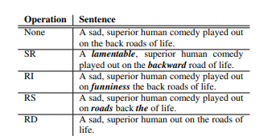

### CV领域

传统的方法：

针对单个样本图像增强：

几何变换：**翻转，旋转，裁剪，变形，缩放**

缩放容易失真

颜色变换：**噪声、模糊、颜色变换、擦除、填充**

改变了图像本身的内容

多样本数据增强：利用多个样本来产生新的样本

SMOTE即Synthetic Minority Over-sampling Technique方法，它是通过人工合成新样本来处理样本不平衡问题，从而提升分类器性能。(图上也有了GraphSMOTE: Imbalanced Node Classification on Graphs with Graph Neural Networks)

SamplePairing方法的原理非常简单，从训练集中随机抽取两张图片分别经过基础数据增强操作(如随机翻转等)处理后经像素以取平均值的形式叠加合成一个新的样本，标签为原样本标签中的一种

现在较流行的方法：

MixUp增强将随机的两张样本按比例混合，分类的结果按比例分配

(在ICML22上出现了基于图的mixup论文 [G-Mixup: Graph Data Augmentation for Graph Classification https://arxiv.org/abs/2202.07179](https://arxiv.org/abs/2202.07179))

Cutout增强随机的将样本中的部分区域cut掉，并且填充0像素值，分类的结果不变，

CutMix将一部分区域cut掉但不填充0像素而是随机填充训练集中的其他数据的区域像素值，分类结果按一定的比例分配

### NLP领域

[EDA: Easy Data Augmentation Techniques for Boosting Performance on Text Classification Tasks](https://arxiv.org/abs/1901.11196)

(1) 同义词替换(SR)：从句子中随机选择非停止词。用随机选择的替换这些单词；

(2) 随机插入(RI)：随机的找出句中某个不属于停用词集的词，并求出其随机的同义词，将该同义词插入句子的一个随机位置。重复n次；

(3) 随机交换(Random Swap, RS)：随机的选择句中两个单词并交换它们的位置。重复n次；

(4) 随机删除(RD)：以概率p随机删除句子中每个单词。

要替换的词是随机选择的，如果语义信息比较重要的话应该怎么办呢？

[Unsupervised Data Augmentation for Consistency Training](https://arxiv.org/pdf/1904.12848.pdf)

引入了一个TF-IDF数值，用来判断哪些词应该被替换。相当于加了个先验，引入了一个指标来衡量一个词对于一个句子的重要性。（GCA（Graph Contrastive Learning with Adaptive Augmentation）和这个挺相似的），引入了图拓扑结构基于节点中心度来衡量边的重要性。

基于上下文的文本信息生成，如去掉一个词输入bert里面，然后bert生成topk个词，生成了新的topk个样本

利用GPT2直接生新文本

nlp领域存在的问题，高质量的数据增强与原始语义

思考角度：避免模型过拟合，数据集中存在某种明显特征，cutout方法可以避免学习到和目标无关的信息

对比学习进行增强的主要目的是什么？找到最本质的特征，那现有的方法能够保证增强之后的信号进行对比时能够保留到有效的信息吗？

图上数据增强：

Topology augmentation:

- [x] (1) Edge Removing (ER)
- [x] (2) Edge Adding (EA)
- [x] (3) Node Shuffle (NS)
- [x] (4) Node Dropping (ND)
- [ ] (5) Subgraph induced by Random Walks (RWS)
- [ ] (6) diffusion with Personalized PageRank (PPR)
- [ ] (7) diffusion with Markov Diffusion Kernels (MDK)

Feature augmentation: 

- [x] (1) Feature Masking (FM) 
- [x] (2) Feature Dropout (FD)