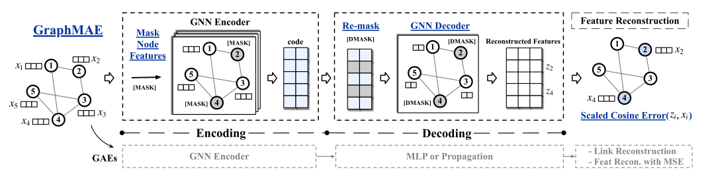
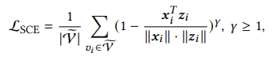

**论文名称：GraphMAE: Self-Supervised Masked Graph Autoencoders**

**论文地址：https://arxiv.org/abs/2205.10803**

**论文简介：图上生成式自监督学习**

## Abstract

对比学习存在的问题：

- 依赖高质量的数据增强。
- 通过额外的策略来稳定训练过程，（负采样，非对称网络结构）

->研究生成方法

已有生成方法的不足：

1. 过于强调结构信息，代理任务大多为链路重构，聚类，链路预测表现好于分类任务
2. 代理任务为特征重构的话太琐碎
3. 损失函数MSE敏感不稳定
4. 解码器大多用MLP，表达能力差

提出了GraphMAE：

1. 带掩码的节点特征重建。现有的Autoencoder通常采用边作为重建目标，但在下游分类任务上表现较差。
2. 带重掩码的解码过程，同时使用GNN作为decoder。现有的Autoencoder通常选用MLP作为解码器，由于大部分图的节点特征都是连续向量，MLP的能力不足以从encoding的结果中重建节点特征。
3. 使用放缩余弦误差(scaled cosine error) 代替MSE作为损失函数。

与BERT和MAE类似，从图中采样部分节点 V，然后用一个掩码标识[MASK]来替换它们的输入节点特征

在解码阶段，GraphMAE使用一种新的“重掩码”(re-mask) 的方式。用另一个掩码标识[DMASK]，即decoder掩码标识向量，再次替换最初采样到的节点的表示。通过使用Re-mask和GNN做的decoder，被遮盖的节点“被要求”从邻近的未被遮盖的节点表示中重建输入特征。

此外采用了余弦误差来度量重建效果，引入可放缩的余弦误差（Scaled Cosine Error）来进一步改进余弦误差

