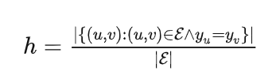

## **同配和异配图：**

- 异质性(Heterogeneous)，强调节点类型和边类型的多样性。同质性，强调节点和边的类型单一。
- 异配性(Heterophily)，强调节点和其邻居的相似度较低(比如标签差异较大)。同配性，强调节点与其邻居特性较为吻合(向量表示或者标签较为接近)。

同配性是许多现实世界图的一个非常重要的原则，即**链接的节点倾向于有类似的特征**，**属于同一类的节点有类似的特征**。

同配度量指标：

图的异配(heterophily)问题：

也就是存在太多类间的边(inter-class edges)，导致在聚合(aggregation)之后，不同类之间的节点的特征会混合在一起，从而变得无法被区分。

同配度量指标数值高，表示图的类内的边(inner-class edges)相对更多，那么GNNs在这个图上会比NNs表现得更好；

如果数值低，那么意味着这是个异配图，GNNs会比NNs表现得更差，也就是图结构提供的信息反而起了副作用(harmful).**大多数现有的GNN都假定有图很强的同配性**，包括GCN，在高异配性下的图上泛化表现很差，甚至比只依靠节点特征进行分类的MLP还要差。

现有解决思路：多层GNN捕捉远程节点（过平滑问题）；重新映射生成图；高通滤波器；

