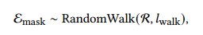
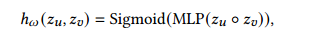
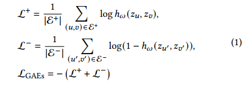
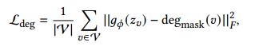
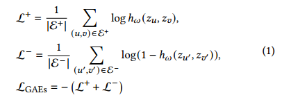
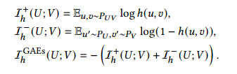

**论文名称：What’s Behind the Mask: Understanding Masked Graph Modeling for Graph Autoencoders**

**论文地址：https://arxiv.org/pdf/2205.10053.pdf**

**论文简介：图上MAE**

## Abstract

自监督代理任务：对比学习是实例判别，而GAE分为两种：

重构特征的 GAE （GraphMAE） 和重构结构的 GAE

MaskGAE在理论上将GAEs与对比学习联系起来，表明MGM在改进GAEs的自我监督学习方案方面的优点。本文揭示了GAEs的学习目标等价于对比学习，其中成对的子图自然地形成两个结构视图来进行对比。最重要的是，在边上进行掩蔽可以减少GAE中两个对比子图视图的冗余，从而有利于对比方案。

- **掩码**（masking）
- **编码**（encoding）
- **解码**（decoding）
- **重构损失**（reconstruction loss）

#### 单边掩码 & 路径掩码

单边掩码使用伯努利分布进行随机掩码

**路径掩码**。它通过预先采样一批节点 $R$，以它们为源节点进行随机游走，得到一批路径：

路径级掩蔽打破了节点之间的短期连接，模型必须在其他地方寻找证据，以适应被掩蔽的结构。因此，它可以更好地利用结构依赖模式，并为更有意义的MGM任务捕获高阶接近性。（更难的任务）

#### 编码

GCN

#### 解码

双解码器

1. 结构解码器（节点之间做链路预测）

2. 度解码器作为一个辅助架构来平衡接近度和结构信息。由于图结构本身的监督信号丰富，我们可以迫使模型在掩蔽图中近似节点度
   $$
   g_\phi\left(z_v\right)=\operatorname{MLP}\left(z_v\right),
   $$

#### **重构损失**

### why work？

**1. 链接对比学习：**最小化Lgae等价于最大化互信息

2. InfoMin 

   原则：自监督学习能够更好地应用在一个下游任务上时，与该任务相关（task relevant）的信息被更好地提取在隐表示中，而与该任务无关（task irrelevant）的信息被舍弃。

   在图上：encoder 一层层的信息传递造成了许多冗余，这些冗余以 task irrelevant 信息的形式保存在**邻接节点的深层隐表示**中。经过 k 层 GNN，输出的隐表示包含了 k 跳子图的聚合信息，而对于两个相邻节点，它们的 k 跳子图间会包含很大的**重叠区域**。

   而通过对边的掩码，可以大幅度减少数据中的 task irrelevant 信息，进而减少自监督信号中的冗余。

   
   
   ### 参考
   
   https://zhuanlan.zhihu.com/p/613554029?utm_id=0