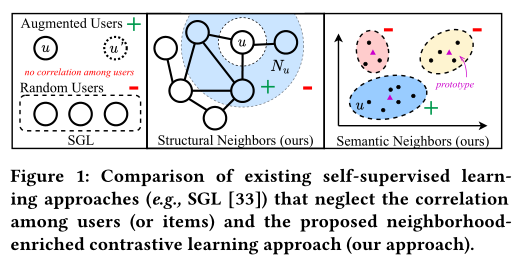
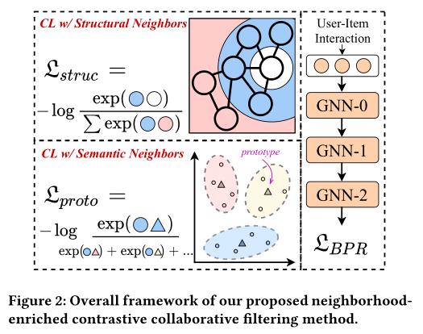
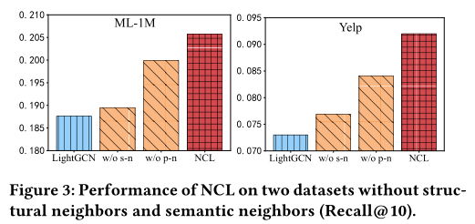
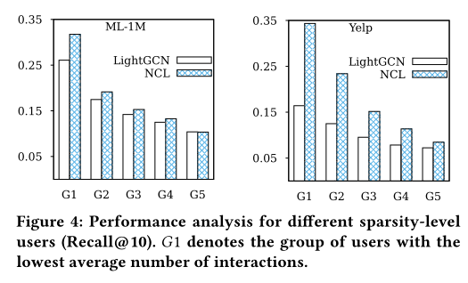
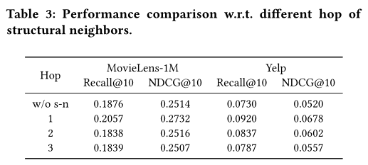

**论文名称：Improving Graph Collaborative Filtering with Neighborhood-enriched Contrastive Learning**

**论文地址：https://arxiv.org/abs/2202.06200**

**论文简介：邻域富集对比学习(NCL)**

## Abstract

存在的问题：

**对比学习通常通过随机抽样来构建对比对，忽略了用户(或项目)之间的相邻关系，未能充分挖掘对比学习在推荐中的潜力。**

为了解决上述问题，作者提出了一种新的对比学习方法，称为邻域富集对比学习(NCL)。

将潜在邻居纳入对比对中。分别从**图结构和语义空间**引入用户(或项目)的邻居。将用户(或项目)及其结构邻居视为正对比对。

在实现中，用户(或项目)和邻居的表示对应于不同GNN层的输出。此外，为了挖掘语义空间中的潜在邻居关系，作者假设具有相似表征的用户位于语义邻居内，并将这些语义邻居纳入原型对比目标中。所提出的NCL可以用EM算法进行优化，并推广到图协同过滤方法中。

#### 1. Introduction

现有的神经图协同过滤方法仍然存在两个主要问题。

首先，用户-项目交互数据通常是稀疏的或有噪声的，并且可能无法学习可靠的表示，因为基于图的方法可能更容易受到数据稀疏性的影响。

其次，现有的基于GNN的CF方法依赖于明确的交互链接来学习节点表示，**而不能明确地利用高阶关系或约束**(例如，用户或项目相似性)来丰富图信息。尽管最近的一些研究利用对比学习来减轻交互数据的稀疏性，但他们通过随机采样节点或破坏子图来构建对比对。缺乏对如何构建针对推荐任务更有意义的对比学习任务的考虑。

(1) 结构邻域指通过高阶路径进行结构连接的节点

(2)语义邻域指语义相似的邻居，可能无法在图上直接到达

#### 3. Method

结构：
$$
\mathcal{L}_S^U=\sum_{u \in \mathcal{U}}-\log \frac{\exp \left(\left(\mathbf{z}_u^{(k)} \cdot \mathbf{z}_u^{(0)} / \tau\right)\right)}{\sum_{v \in \mathcal{U}} \exp \left(\left(\mathbf{z}_u^{(k)} \cdot \mathbf{z}_v^{(0)} / \tau\right)\right)}
$$

$$
\mathcal{L}_S^I=\sum_{i \in I}-\log \frac{\exp \left(\left(\mathbf{z}_i^{(k)} \cdot \mathbf{z}_i^{(0)} / \tau\right)\right)}{\sum_{j \in I} \exp \left(\left(\mathbf{z}_i^{(k)} \cdot \mathbf{z}_j^{(0)} / \tau\right)\right)}
$$

语义：kmeans得到prototype嵌入
$$
\mathcal{L}_P^U=\sum_{u \in \mathcal{U}}-\log \frac{\exp \left(\mathbf{e}_u \cdot \mathbf{c}_i / \tau\right)}{\sum_{\mathbf{c}_j \in C} \exp \left(\mathbf{e}_u \cdot \mathbf{c}_j / \tau\right)}
$$

$$
\mathcal{L}_P^I=\sum_{i \in I}-\log \frac{\exp \left(\mathbf{e}_i \cdot \mathbf{c}_j / \tau\right)}{\sum_{\mathbf{c}_t \in C} \exp \left(\mathbf{e}_i \cdot \mathbf{c}_t / \tau\right)} .
$$

#### 4. Experiments

小位置(如前10名)的改进大于大位置(如前50名)

NCL倾向于对相关项目进行更高的排名

在小型数据集(如ML-1M和Yelp数据集)上产生了更多的改进（数据集的交互数据更稀疏，没有足够的邻居来构建对比对）

#### 5. 消融实验

两种变体：

稀疏性：

跳数：

超参数的消融