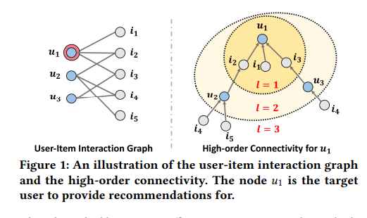
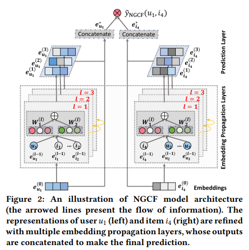

**论文名称：Neural Graph Collaborative Filtering**

**论文地址：https://arxiv.org/pdf/1905.08108.pdf**

**论文简介：**

## Abstract

MF的设计思路是user和item各自维护一个embedding，利用bpr去推开正item和负item之间的距离，

存在问题：用户和物品分开被处理，忽略了用户-物品之间的联系，嵌入层显然不包含这一联系。

NGCF的提出，用来解决了用户和物品交互信息的传播信号无法在嵌入层中表现这一问题。

$\mathbf{E}^{(l)}=\operatorname{LeakyReLU}\left((\mathcal{L}+\mathrm{I}) \mathbf{E}^{(l-1)} \mathbf{W}_1^{(l)}+\mathcal{L} \mathbf{E}^{(l-1)} \odot \mathbf{E}^{(l-1)} \mathbf{W}_2^{(l)}\right)$,

$\mathcal{L}=\mathrm{D}^{-\frac{1}{2}} \mathrm{AD}^{-\frac{1}{2}}$ and $\mathrm{A}=\left[\begin{array}{cc}0 & \mathbf{R} \\ \mathbf{R}^{\top} & \mathbf{0}\end{array}\right]$,

把从0-3的所有层concat

$\mathbf{e}_u^*=\mathbf{e}_u^{(0)}\|\cdots\| \mathbf{e}_u^{(L)}, \quad \mathbf{e}_i^*=\mathbf{e}_i^{(0)}\|\cdots\| \mathbf{e}_i^{(L)}$

得到了user，item的embedding

#### 

