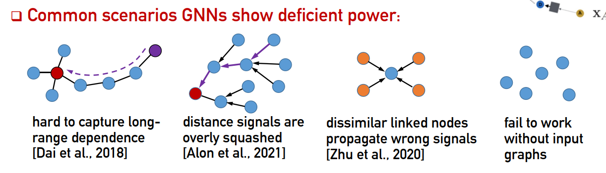
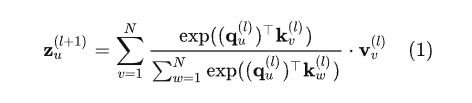
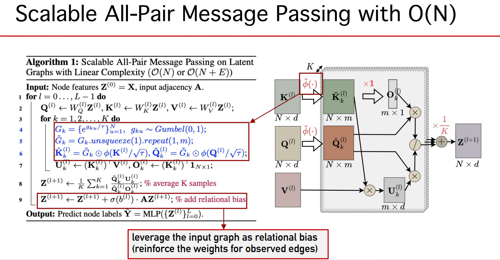

**论文名称：NodeFormer: A Scalable Graph Structure Learning Transformer for Node Classification**

**论文地址：https://openreview.net/pdf?id=sMezXGG5So**

**论文简介：大图上的节点级Transformer**

## Abstract

GNN “沿着固定输入图结构进行信息传递” 的设计思路存在不足：

1. 由于每层聚合只考虑相邻节点间的信息传递，这种有限的感受野设计使得GNN无法有效利用来自其他节点的全局信息。

2. 此外，在很多下游任务中，输入数据可能并不包含图结构（如图片分类中，每张图片样本是独立的），此时GNN对输入图结构的依赖性导致其无法正常工作。

文章提出了一种新型的图表征模型架构，称为NodeFormer：

1. 实现了每层任意两两节点间的信息传递，即在每层的信息聚合中会考虑图中所有其他节点对当前节点的影响。
2. **NodeFormer设计思想的直观理解就是把GNN定义在了一个两两节点潜在相连且每层的图拓扑可学习的计算图上。** 
3. 计算复杂度高->（节点数目的平方级复杂度），使其无法扩展到大规模节点分类图上。为此本文提出了一种具有线性复杂度的可变图结构信息传递方法，使得上述思路首次成功扩展到了百万级规模的节点分类图上，这一方法还能被用于处理没有输入图的问题。

#### 3. Method

融合Random Feature Map和Gumbel-Softmax

$O\left(N^2\right)$ 复杂度，采用核方法对exponential-then-dot这一操作进行近似：

$\exp \left(\mathbf{a}^{\top} \mathbf{b}\right)=\kappa(\mathbf{a}, \mathbf{b}) \approx \phi(\mathbf{a})^{\top} \phi(\mathbf{b})$， $\phi$ 是 Random Feature Map，如Positive Random Feature（PRF）可以定义为：

$\displaystyle \phi(\mathbf{x})=\frac{\exp \left(\frac{-\|\mathbf{x}\|_2^2}{2}\right)}{\sqrt{m}}\left[\exp \left(\mathbf{w}_1^{\top} \mathbf{x}\right), \cdots, \exp \left(\mathbf{w}_m^{\top} \mathbf{x}\right)\right]$

$\displaystyle \mathbf{z}_u^{(l+1)}=\sum_{v=1}^N \frac{\phi\left(\mathbf{q}_u\right)^{\top} \phi\left(\mathbf{k}_v\right)}{\sum_{w=1}^N \phi\left(\mathbf{q}_u\right)^{\top} \phi\left(\mathbf{k}_w\right)} \cdot \mathbf{v}_v=\frac{\phi\left(\mathbf{q}_u\right)^{\top} \sum_{v=1}^N \phi\left(\mathbf{k}_v\right) \cdot \mathbf{v}_v}{\phi\left(\mathbf{q}_u\right)^{\top} \sum_{w=1}^N \phi\left(\mathbf{k}_w\right)}$

上述过程假设每条连边有一个连续的注意力权重值，但考虑连边“离散化”：对于任意节点u，我们其实需要的是找到在每一层中一个“最优”的邻居集合，进行信息传递，把N个节点产生的注意力权重视为一个Categorical Distribution，然后从中采样得到邻居集合。尽管采样的过程不可求导，我们可以借助Gumbel-Softmax对其进行近似处理：

$\displaystyle \mathbf{z}_u^{(l+1)}=\sum_{v=1}^N \frac{\exp \left(\left(\mathbf{q}_u^{\top} \mathbf{k}_u+g_v\right) / \tau\right)}{\sum_{w=1}^N \exp \left(\left(\mathbf{q}_u^{\top} \mathbf{k}_w+g_w\right) / \tau\right)} \cdot \mathbf{v}_u, \quad g_u \sim \operatorname{Gumbel}(0,1)$

$\displaystyle \mathbf{z}_u^{(l+1)}=\sum_{v=1}^N \frac{\phi\left(\mathbf{q}_u / \sqrt{\tau}\right)^{\top} \phi\left(\mathbf{k}_v / \sqrt{\tau}\right) e^{g_v / \tau}}{\sum_{w=1}^N \phi\left(\mathbf{q}_u / \sqrt{\tau}\right)^{\top} \phi\left(\mathbf{k}_w / \sqrt{\tau}\right) e^{g_w / \tau}} \cdot \mathbf{v}_v
=\frac{\phi\left(\mathbf{q}_u / \sqrt{\tau}\right)^{\top} \sum_{v=1}^N e^{g_v / \tau} \phi\left(\mathbf{k}_v / \sqrt{\tau}\right) \cdot \mathbf{v}_v}{\phi\left(\mathbf{q}_u / \sqrt{\tau}\right)^{\top} \sum_{w=1}^N e^{g_w / \tau} \phi\left(\mathbf{k}_w / \sqrt{\tau}\right)}$

#### 

如何加入边的信息？

两种方式：

**Relational Bias** 

在每层信息传递时，对观测连边的权重进行加强，为每条边赋予一个共享的可学习的权重，称作relational bias，于是每层的更新公式更改为

$\mathbf{z}_u^{(l+1)} \leftarrow \mathbf{z}_u^{(l+1)}+\sum_{v, a_{u v}=1} \sigma\left(b^{(l)}\right) \cdot \mathbf{v}_v$

**Edge Regularization Loss** 

把观测连边作为监督信号，加入到学习目标函数中。具体的，我们把模型每层的注意力估计视为一个Categorical Distribution，而观测连边视为样本，于是采用极大似然估计定义一个连边的损失函数

$\mathcal{L}_e(\mathbf{A}, \tilde{\mathbf{A}})=-\frac{1}{N L} \sum_{l=1}^L \sum_{(u, v) \in \mathcal{E}} \frac{1}{d_u} \log \pi_{u v}^{(l)}$

最后的loss：

$\mathcal{L}_s\left(\mathbf{Y}_{t r}, \hat{\mathbf{Y}}_{t r}\right)=-\frac{1}{N_{t r}} \sum_{v \in \mathcal{N}_{t r}} \sum_{c=1}^C \mathbb{I}\left[y_u=c\right] \log \hat{y}_{u, c}$

$\mathcal{L}=\mathcal{L}_s+\lambda \mathcal{L}_e$

参考：

https://zhuanlan.zhihu.com/p/587086593

https://openreview.net/pdf?id=sMezXGG5So

https://qitianwu.github.io/assets/NodeFormer-slides.pdf