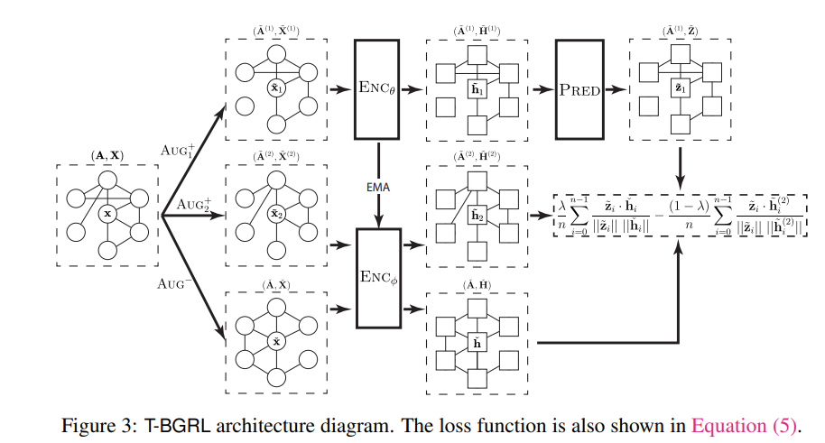

**论文名称：Link Prediction with Non-Contrastive Learning**

**论文地址：https://arxiv.org/abs/2211.14394**

**论文简介：第一个使用非对比的自监督学习方法进行链路预测**

## Abstract

BGRL(现有的非对比模型)在传导链接预测中表现良好，其性能与对比基线相当，在推动正、负节点对方面隐含地表现类似于其他对比模型。

非对比性SSL模型在归纳设置中表现不如对比性SSL模型，并注意到由于缺乏负面示例，它们的泛化效果很差。

有了这种理解，作者提出了T -BGRL，这是一种新颖的非对比方法，使用廉价的“负”样本来提高泛化。T -BGRL实现简单，与对比方法相比非常高效，并提高了BGRL在5/6数据集上的归纳性能，使其与最佳对比基线持平或以上。

#### 1. Introduction

链路预测问题：

1. src和dst的都要考虑
2. 候选集是O(n^2)的
3. 优化目标应该是rank而不是classification（topk）

### 2. Method

最后建模成bgrl显式加上负样本

如果是在节点任务这种的话 如果给bgrl再添加负样本上去是会drop的，但是链路预测可能需要的节点表征更具有区分性？

