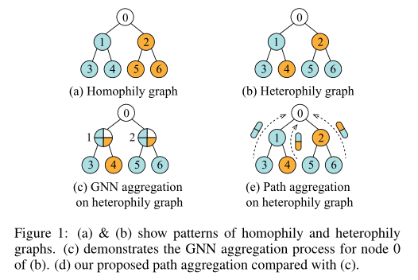
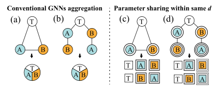

**论文名称：Beyond Homophily: Structure-aware Path Aggregation Graph Neural Network**

**论文地址：https://www.ijcai.org/proceedings/2022/0310.pdf**

**论文简介：将 GNN 同时推广到同配图和异配图上**

## Abstract

#### 同配：

相连接的结点对倾向于拥有相似的特征，或属于同种类别。

本文聚焦于图上的路径，用来表示丰富的语义和结构信息，提出了路径聚合图神经网络旨在将 GNN 同时推广到同质图和异质图上。

最大熵路径采样器：对包含结构上下文的许多路径进行采样

结构感知的循环单元：由顺序保持和距离感知组成，以学习邻域的语义信息

对路径编码后不同路径对目标节点的偏好进行建模

#### 1. Introduction

对于异配图：节点1和2的聚合特征经过聚合后无法区分，而节点1和节点2的原始节点特征不同，表明gnn的聚集过程存在缺陷。

思路：通过聚合所有相关路径而不是其邻域来学习每个节点的嵌入

问题：

1. 如何取样路径，太多，怎么算有意义
2. 聚合函数里面是顺序不敏感的，设计保存顺序的聚合函数
3. 节点的偏好：接近目标节点的路径被同配邻域优先选择，而探索深层接受野的路径被异配邻域选择

解决方法：

1. 最大熵路径采样器
2. 引入循环机制保持顺序的聚合函数
3. 引入注意力机制

#### 3. Method

1. 最大熵路径采样器

   传统的随机漫步(CRW)对不同节点的处理是相同的，忽略了图中节点的中心性。

   MERW在熵率增加的方向上寻找每一步的路径，并结合特征向量中心性
   $$
   \mathbf{P}_u=\frac{\mathbf{D}_u^{-1} \mathbf{A} \mathbf{D}_u}{\lambda}
   $$

2. 结构感知路径聚合器

   能够将路径中每个节点的顺序和距离信息结合起来，从而捕获语义信息。

   

   a，b这两个图经过两层聚合后会产生相同的节点嵌入T

   c，d虽然引入了路径，但是也会产生相同的嵌入

   （思路：c，d可以解决a，b，但是会产生新的问题，所以再设计一个：将到目标的距离信息嵌入到有向路径序列中）

   最终：

   

   $U_d$ 是提前算好的最短路距离的嵌入

3. 注意力机制选择路径

   对于同态邻域，目标节点附近的路径可能更有助于分类，而对于异态邻域，探索更广泛的图结构背景的路径将是首选。引入路径注意力：

   

   最终嵌入的输出：
   $$
   \mathbf{z}_v=\sigma\left(\mathbf{W}_{\text {out }}\left(\mathbf{I}_v \| \sum_{j \in p} \boldsymbol{s}_{v, p} \mathbf{h}_p\right)+\mathbf{b}_{\text {out }}\right)
   $$

#### 4. Experiments

