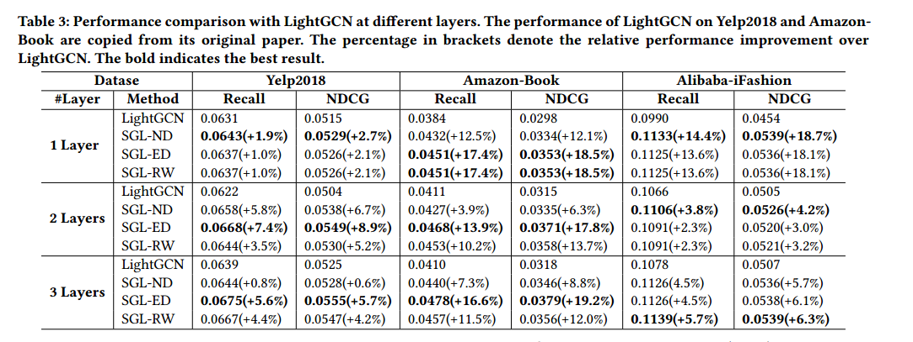
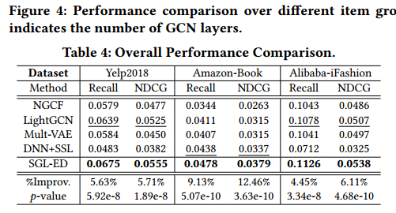
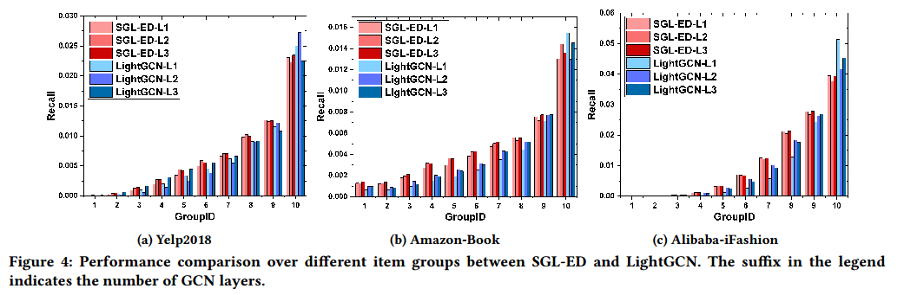
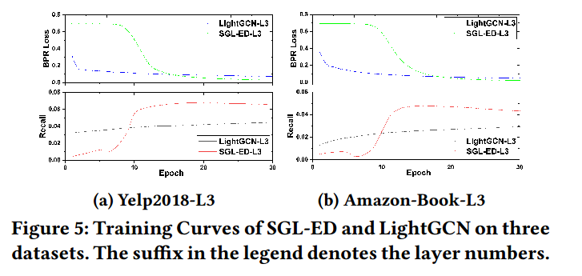
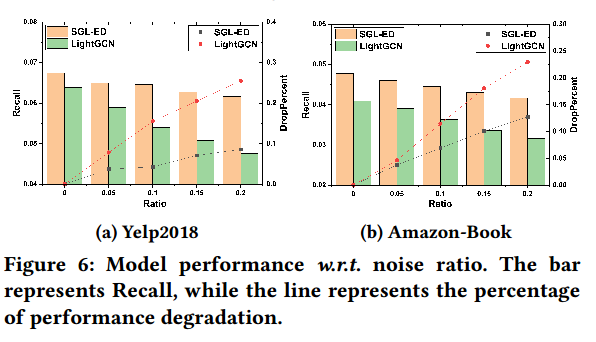

**论文名称：Self-supervised Graph Learning for Recommendation**

**论文地址：https://arxiv.org/pdf/2010.10783.pdf**

**论文简介：图推荐+自监督**

## Abstract

GCN可以捕捉高阶邻居关系，已经在推荐上广泛应用。

但存在几个问题：

1. 监督信号很稀疏，学习到的表征关系质量不高。

2. 长尾问题，GCN对于长尾项目的学习效果一般
3. 交互存在噪声。正反馈大部分都是隐式的，而领域聚合扩大了交互对于表示的影响，使学习更容易受到交互噪声的影响。

引进SSL，作为辅助任务，学习更好的表征。

数据增强：三种：节点dropout、边dropout和随机游走

边dropout减少高度节点的影响来缓解度偏差；不同局部结构和邻域的节点多视图增强了模型对交互噪声的鲁棒性；

理论：softmax的温度超参数鼓励模型学到了hard negative。

#### 3. Method

构建二分图，连边是交互信息，底层是lightgcn作为backbone

最终得到的嵌入：
$$
\mathbf{z}_u=f_{\text {readout }}\left(\left\{\mathbf{z}_u^{(l)} \mid l=[0, \cdots, L]\right\}\right)
$$
嵌入用来完成两个任务：

1. 监督任务（bprloss）

   $\mathcal{L}_{\text {main }}=\sum_{(u, i, j) \in O}-\log \sigma\left(\hat{y}_{u i}-\hat{y}_{u j}\right)$

2. 自监督任务

   增强方法：与CV和NLP任务将每个数据实例视为孤立的不同，交互图中的用户和项之间具有内在的联系和相互依赖。所以要定制新的增强方法。

   Node dropout：（既丢弃节点也丢弃边）

   $s_1(\mathcal{G})=\left(\mathbf{M}^{\prime} \odot \mathcal{V}, \mathcal{E}\right), \quad s_2(\mathcal{G})=\left(\mathbf{M}^{\prime \prime} \odot \mathcal{V}, \mathcal{E}\right)$

   Edge dropout：（抗噪声？）

   $s_1(\mathcal{G})=\left(\mathcal{V}, \mathbf{M}_1 \odot \mathcal{E}\right), \quad s_2(\mathcal{G})=\left(\mathcal{V}, \mathbf{M}_2 \odot \mathcal{E}\right)$

   Random walk：（每一层做一次dropedge当作子图）

   对比优化目标：SimCLR的InfoNCE

   $\mathcal{L}_{s s l}^{u s e r}=\sum_{u \in \mathcal{U}}-\log \frac{\exp \left(s\left(\mathbf{z}_u^{\prime}, \mathbf{z}_u^{\prime \prime}\right) / \tau\right)}{\sum_{v \in \mathcal{U}} \exp \left(s\left(\mathbf{z}_u^{\prime}, \mathbf{z}_v^{\prime \prime}\right) / \tau\right)}$

   类似的，对item也做一次，

   然后得到的最终自监督loss：

   $\mathcal{L}_{s s l}=\mathcal{L}_{s s l}^{u s e r}+\mathcal{L}_{s s l}^{\text {item }}$

Why work？

从hard negative的梯度大出发

#### 4. Experiments

1. 在大多数情况下，三种SGL实现的性能都大大优于LightGCN，这表明了用自监督学习补充推荐任务的优越性
2. ED和RW一般都要好于ND，此外，在密集数据集(Yelp2018和Amazon-Book)中，SGL-ED的性能优于SGL-RW，而在稀疏数据集(Alibaba-iFashion)中，SGL-ED的性能略差。（在更稀疏的数据集中，ED更有可能阻塞低度节点(不活跃的用户和不受欢迎的项目)的连接，而RW可以在不同的层上恢复他们的连接。
3. Node Dropout可以被看作是Edge Dropout的一种特殊情况，它丢弃了一些节点周围的边。因此，删除高次节点将极大地改变图的结构，从而对信息聚集产生影响，使训练不稳定
4. Amazon-Book和alibaba - ifason数据集上表现的更好，可能是因为Amazon-Book和alibaba - ifason比较稀疏，来自用户-物品交互的监督信号过于稀疏，无法指导LightGCN中的表示学习。
5. layer越大，效果越好，即不同节点之间的对比学习有望解决节点表示的过平滑问题，进一步避免过拟合问题。

DNN+SSL是Amazon-Book上最强的基线，显示了SSL在推荐方面的巨大潜力。令人惊讶的是，在其他数据集上，DNN+SSL的表现比SGL-ED差得多。这表明直接在ID嵌入上应用SSL可能不如在图表示上应用SSL最优。

### SSL带来的好处：

(1)长尾推荐;(2)训练效率;(3)噪声的鲁棒性

根据流行度将项目分为10组，同时保持每组的交互总数相同。GroupID越大，项的度数越大

第10组虽然只包含0.83%、0.83%和0.22%的项空间，但在三个数据集中分别贡献了**39.72%、39.92%和51.92%**的总Recall分数。由于交互信号稀疏，LightGCN很难学习长尾项的高质量表示。

SGL显示出缓解这一问题的潜力:在三个数据集中，10组ED的贡献分别为36.27%，29.15%和35.07%

在训练效率上，SGL更容易收敛：

SGL收敛的快很多，10来个epoch就达到最优了，可能的原因：InfoNCE相较于BPRLOSS是对比多个负样本

鲁棒性：

手动污染数据集，添加噪声数据会降低SGL和LightGCN的性能。但是，SGL的性能下降比LightGCN低;

此外，随着噪声比的增加，两条退化曲线之间的差距越来越明显。这表明，通过比较节点的不同增强视图，SGL能够找出有用的模式，特别是节点的信息图结构，并减少对某些边的依赖。简而言之，SGL提供了一个不同的角度来去噪推荐中的假阳性相互作用。

在amazon-book数据集中，附加20%噪声交互的SGL性能仍然优于无噪声数据集的LightGCN。这进一步证明了SGL相对于LightGCN的优越性和鲁棒性

SGL在Yelp2018上更健壮。可能的原因是Amazon-Book比Yelp2018稀疏得多，添加噪声数据对Amazon-Book的图结构影响比Yelp2018大。

### 参数消融：

1. 温度参数的影响
2. 负样本的选择对辅助任务的影响。

   考虑了两种变体:(1)SGL-ED-batch，它区分节点类型，并将用户和小批中的物品分别视为用户和物品的负面视图;(2)SGL-ED-merge，它将小批中的节点视为负面视图，而不区分节点类型。我们在表5中报告比较。SGL-ED-batch的性能优于SGL-ED-merge，这表明区分异构节点类型的必要性。此外，SGLED-batch与SGL-ED相同，后者将用户和物品的整个空间视为负值。这表明在小批处理中训练SSL任务是一种有效的替代方法。