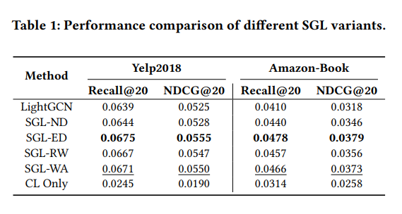
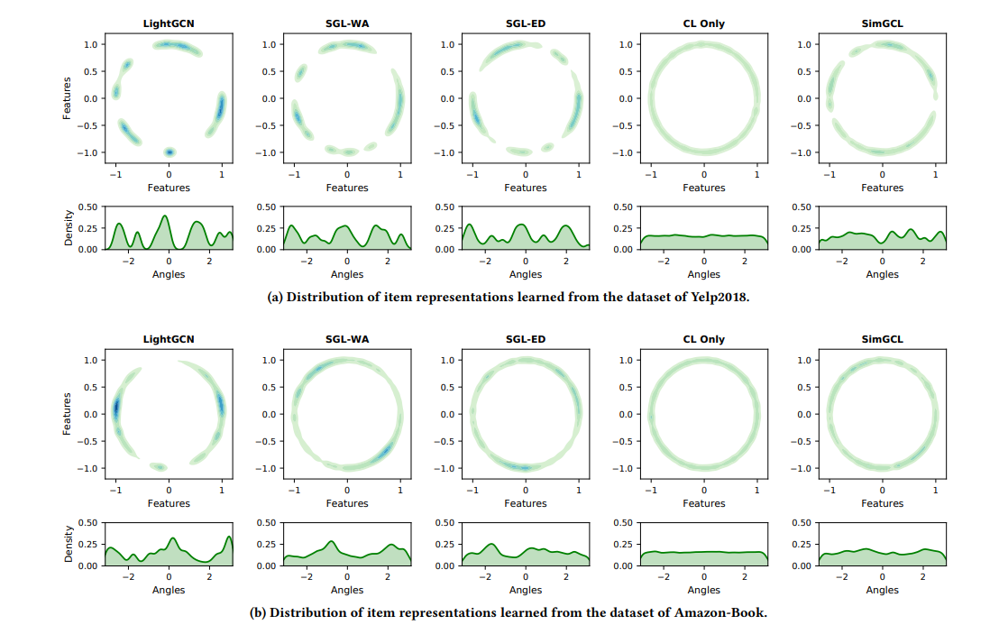
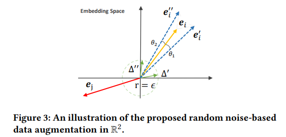
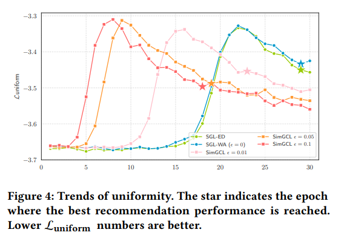
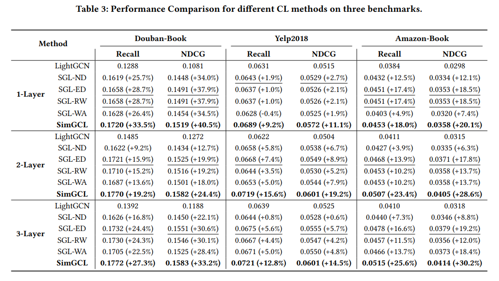
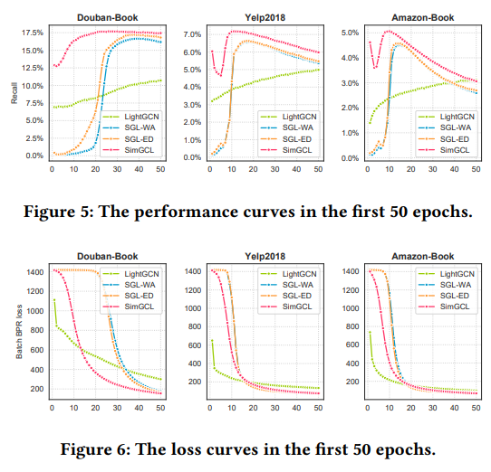
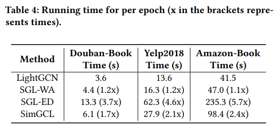
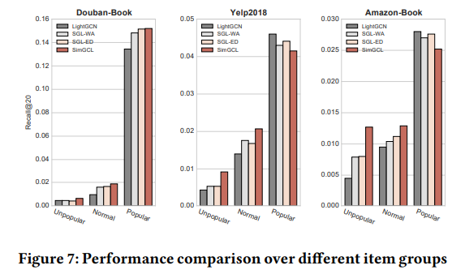

**论文名称：Are Graph Augmentations Necessary? Simple Graph Contrastive Learning for Recommendation**

**论文地址：https://dl.acm.org/doi/pdf/10.1145/3477495.3531937**

**论文简介：简单的对比学习方法，丢弃图增强机制，将均匀噪声添加到嵌入空间以创建对比视图**

## Abstract

通过实验证明了：面向推荐的图对比学习中，图增强不是必须的。而对比学习对于推荐效果的提升主要来自于学习到更均匀的表征分布。基于此，文章提出了一个极简的图对比学习方法，在推荐性能，训练/收敛速度以及去偏能力等多个方面具有非常好的性能。

#### 1. Introduction

基于对比学习的推荐算法，通常采用两步走的范式：

1）通过结构扰动增强user-item二部图，得到不同对比视图（view）；

2）最大化不同对比视图之间节点表示的一致性（consistency）。

why work？

第一个小实验：SGL的各种变体对于推荐效果的提升：
$$
\begin{gathered}
\mathcal{L}_{\text {joint }}=\mathcal{L}_{r e c}+\lambda \mathcal{L}_{c l} \\
\mathcal{L}_{c l}=\sum_{i \in \mathcal{B}}-\log \frac{\exp \left(\mathbf{z}_i^{\prime \top} \mathbf{z}_i^{\prime \prime} / \tau\right)}{\sum_{j \in \mathcal{B}} \exp \left(\mathbf{z}_i^{\prime \top} \mathbf{z}_j^{\prime \prime} / \tau\right)}
\end{gathered}
$$

$$
\mathcal{L}_{c l}=\sum_{i \in \mathcal{B}}-\log \frac{\exp (1 / \tau)}{\sum_{j \in \mathcal{B}} \exp \left(\mathbf{z}_i^{\top} \mathbf{z}_j / \tau\right)}
$$

- 丢掉图增强，模型依然表现不错，甚至优于部分图增强模型，如SGL-ND和SGL-RW

- SGL-ND和SGL-RW在一定程度上破坏了图的原有结构关联，对推荐结果有一定负作用；而一次性的edge dropout，即SGL-ED，损坏原始图的可能性较小

- **恰当的图增强**可以有效提升推荐效果

  第二个小实验：

**InfoNCE影响更多：** 对比学习损失函数强化特征表示的两个特性：1）正样本对的对齐性（**alignment**）2）归一化特征分布的均匀性（**uniformity**）。为了分析特征表示的均匀性，将不同模型学习到的节点表示进行可视化。

LigthGCN学习到的特征表示聚类现象更明显，结合对比学习的SGL的特征表示相对均匀，只有对比损失函数的 CL Only学习到几乎完全均匀的特征表示（本质上在优化cos相似性）。

主要有两个原因：1）GCN的**消息传递机制**的特征局部相似；2）**热门偏差**，BPR损失函数导致user/item节点表示持续向热门item的方向进行梯度更新。

**特征分布的均匀性**是影响推荐效果的潜在决定性因素，而非基于dropout的图增强。同时，优化对比损失函数（InfoNCE）带来了更均匀的特征表示，在一定程度上实现了**热度debias**。

#### 3. Method

给定节点$u$和节点表示$i$，SimGCL直接**在特征空间中增加随机噪声** 实现表征级的增强：
$$
\mathbf{e}_i^{\prime}=\mathbf{e}_i+\Delta_i^{\prime}, \quad \mathbf{e}_i^{\prime \prime}=\mathbf{e}_i+\Delta_i^{\prime \prime},
$$

通过添加噪声，可以看作是使得原始表征向量在空间上旋转了两个小的角度，当旋转角度较小时，既保留了大部分原始信息，又带来了语义上的不同。

LightGCN作为backbone，加入噪声扰动：
$$
\begin{aligned}
\mathbf{E}^{\prime}=\frac{1}{L}\left(\left(\tilde{\mathrm{A}} \mathrm{E}^{(0)}+\Delta^{(1)}\right)+\left(\tilde{\mathrm{A}}\left(\tilde{\mathrm{A}} \mathrm{E}^{(0)}+\Delta^{(1)}\right)+\Delta^{(2)}\right)\right)+\ldots \\
\left.+\left(\tilde{\mathrm{A}}^L \mathbf{E}^{(0)}+\tilde{\mathrm{A}}^{L-1} \Delta^{(1)}+\ldots+\tilde{\mathrm{A}} \Delta^{(L-1)}+\Delta^{(L)}\right)\right)
\end{aligned}
$$

#### 4. Experiments

通过调节噪声半径epsilon的大小，可以平滑的调节表征的分布均匀性，并用实验证明了其可行性。

作者在yelp2018数据集上随机抽取了5000用户以及所有交互超过200的流行项目，通过如下公式计算分布的均匀性。
$$
\mathcal{L}_{\text {uniform }}(f)=\log \underset{\substack{i . i . d \\ u, v \sim p_{\text {node }}}}{\mathbb{E}} e^{-2\|f(u)-f(v)\|_2^2}
$$

- 最开始，所有方法都具有高度均匀分布的特征表示，采用了均匀分布的Xavier初始化方法。
- 训练迭代增加，均匀性下降，到达峰值后均匀性逐渐提高，直至收敛并保持较高均匀性。SimGCL的均匀性更好，特征表示更加均匀，user表示（特别是长尾用户）受到热门item的影响会更小。越大的噪声半径带来了越高的均匀性

推荐准确性，收敛速度，运行速度，去偏能力，不同噪声类型的影响实验：

推荐准确性：

收敛速度：

SimGCL只需SGL所需的2/3迭代次数即可收敛，LightGCN收敛速度较慢

运行速度：

去偏性：

SimGCL的提升更多是来自非热门item（长尾item）的有效推荐，而LigthGCN更偏好于推荐热门item

将所有项目划分为三组：非流行项目（交互数排名后80%），流行项目（交互数排名前5%），普通项目（交互数居中）

## 参考：

https://zhuanlan.zhihu.com/p/549092889

https://zhuanlan.zhihu.com/p/509511858