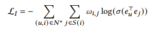

**论文名称：UltraGCN: Ultra Simplification of Graph Convolutional Networks for Recommendation**

**论文地址：https://arxiv.org/abs/2110.15114**

## Abstract

1)消息传递过程中对边缘分配的权重是反直觉的，这可能不适合CF。

2)传播过程递归地将不同类型的关系对(包括用户-项目对、项目-项目对和用户-用户对)组合到模型中，但未能捕捉到它们不同的重要性。这也可能引入嘈杂和无信息的关系，从而混淆模型训练。

3)过度平滑问题限制了在LightGCN中使用太多的消息传递层。

没有执行显式的消息传递，而是寻求通过约束损失直接近似无限层图卷积的极限，基于损失的UltraGCN设计非常灵活，允许我们手动调整不同类型关系的相对重要性，也避免了负采样的过度平滑问题。该模型易于实现，训练效率高。

#### 1. Motivation

可以看到，在训练具有消息传递层的基于gcn的模型时，捕获了多种不同类型的协作信号，包括用户-项目关系(𝑢-i和𝑘-𝑣)、项目-项目关系(i-k)和用户-用户关系(𝑢-𝑣)。这也揭示了为什么基于gcn的模型对CF是有效的。

存在局限：

1. 给定用户𝑢，项目k的权重因子和项目i的权重因子i是不对称的。
2. 三种关系的捕捉没有明确重要性
3. 无限堆叠性能下降

#### 2. Method

不使用消息传递，直接到达收敛态：

也会过平滑，所以再加个限制：

再加个损失，变成链路预测问题：

再考虑item-item图：

